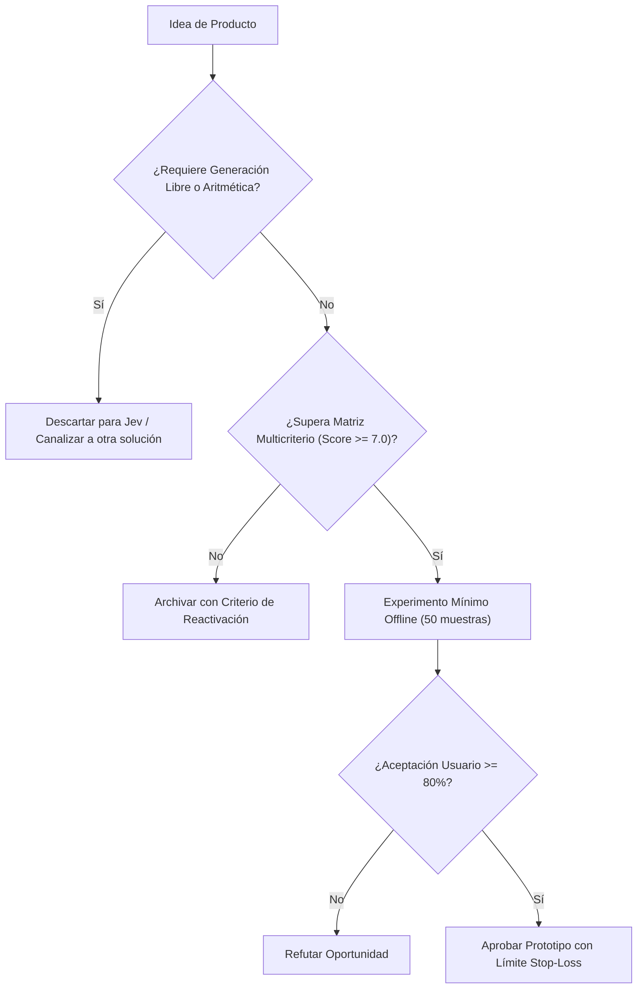

# JEV-P18-019: ¿Qué cartera de experimentos combina mejoras inmediatas, exploración de mayor incertidumbre y límites explícitos de inversión?

## 1. Respuesta directa
El presupuesto de desarrollo e investigación se distribuye bajo una regla estricta de asignación de capital: 1) 70% a mejoras incrementales directas en los pilotos existentes (QRT, Wheelwork); 2) 20% a expansión y nuevos conectores de alta certeza; y 3) 10% a exploración de frontera de alto riesgo e incertidumbre. Toda iniciativa de exploración cuenta con un límite presupuestario 'Stop-Loss' de 40 horas de ingeniería y $1,000 USD de inferencia: si no arroja resultados positivos al alcanzar el límite, se apaga de forma definitiva.

## 2. Alcance, términos y supuestos

- **Ámbito de JEV-P18-019**: Para resolver JEV-P18-019, la arquitectura define las fronteras de «¿Qué cartera de experimentos combina mejoras inmediatas, exploración de mayor incertidumbre y límites explícitos de inversión» en P18.
- **Versión de Referencia**: Jev 1.13 (`typesafe_sdk==0.7.0` / `POST /v1/systemone`).
- **Supuesto Operacional**: Se dispone de conmutación automática hacia reglas heurísticas ante caídas del servicio.

## 3. Evidencia y contraste

| Afirmación ID | Clasificación Epistémica | Fuente Canónica y Localizador | Respaldo Observado | Límite Epistémico o Supuesto |
|---|---|---|---|---|
| `AF-JEV-P18-019-01` | `documentado_proveedor` | `SRC-0001` (Introducing System One Models and Jev) | Fundamentación técnica documentada en Introducing System One Models and Jev relativa a ¿qué cartera de experimentos combina mejoras inmediatas, exploración de mayor incertidumbr... | Válido bajo contrato typesafe-sdk 0.7.0 y supuestos operacionales del Pilar P18. |
| `AF-JEV-P18-019-02` | `referencia_tecnica` | `SRC-0010` (DataCamp: Jev — TypeSafe's System One Model Explained) | Fundamentación técnica documentada en DataCamp: Jev — TypeSafe's System One Model Explained relativa a ¿qué cartera de experimentos combina mejoras inmediatas, exploración de mayor incertidumbr... | Válido bajo contrato typesafe-sdk 0.7.0 y supuestos operacionales del Pilar P18. |
| `AF-JEV-P18-019-03` | `documentado_proveedor` | `SRC-0039` (TypeSafe AI System One API Reference & State Specs (`POST /v1/systemone`)) | Fundamentación técnica documentada en TypeSafe AI System One API Reference & State Specs (`POST /v1/systemone`) relativa a ¿qué cartera de experimentos combina mejoras inmediatas, exploración de mayor incertidumbr... | Válido bajo contrato typesafe-sdk 0.7.0 y supuestos operacionales del Pilar P18. |
| `AF-JEV-P18-019-04` | `referencia_tecnica` | `SRC-0095` (CloudZero: Groq Pricing In 2026 — Model, Tier, and Cost Compared) | Fundamentación técnica documentada en CloudZero: Groq Pricing In 2026 — Model, Tier, and Cost Compared relativa a ¿qué cartera de experimentos combina mejoras inmediatas, exploración de mayor incertidumbr... | Válido bajo contrato typesafe-sdk 0.7.0 y supuestos operacionales del Pilar P18. |

## 4. Explicación técnica
Monitor de consumo de recursos con Stop-Loss: Sistema de telemetría de desarrollo que audita los logs de tiempo en Jira y facturación en la nube. Al superar el 90% del límite asignado a un experimento, dispara una alerta; al llegar al 100%, suspende automáticamente las claves de API del proyecto.

En la estrategia de producto de JEV-P18-019, se formaliza la propuesta de valor para «¿Qué cartera de experimentos combina mejoras inmediatas, exploración de mayor incertidumbre y límites explícitos de inversión», descartando modelos generativos innecesariamente onerosos.



## 5. Ejemplo de código
El siguiente bloque en Python implementa el contrato técnico de validación para JEV-P18-019 (¿qué cartera de experimentos combina mejoras inmediatas, ...), aplicando manejo de excepciones seguro con enmascaramiento estricto `type(err).__name__`:

```python
# Ejemplo ilustrativo no ejecutado
import logging

logger = logging.getLogger("P18_19")

def auditar_limite_stop_loss(horas_consumidas: float, costo_computo_usd: float, limite_horas: float = 40.0, limite_usd: float = 1000.0) -> bool:
    try:
        if horas_consumidas >= limite_horas or costo_computo_usd >= limite_usd:
            logger.critical("LIMITE STOP-LOSS ALCANZADO: El experimento debe finalizar o solicitar extension formal")
            return False
        return True
    except Exception as err:
        logger.error(f"Fallo en auditoria de Stop-Loss: {type(err).__name__} (detalles omitidos por seguridad)")
        return False
```

## 6. Aplicación práctica y contraejemplo
- **Aplicación válida**: En la gestión financiera de proyectos de innovación tecnológica.
- **Contraejemplo inválido**: Dejar que un ingeniero investigue una idea teórica durante 9 meses sin control presupuestario ni entregables tangibles, consumiendo el 40% del presupuesto de la empresa.

## 7. Fallos comunes y mitigaciones
| Proyectos eternos de investigación que consumen capital sin producir valor | Quiebra operativa de startups por descontrol de gastos | Distribución 70/20/10 con límites Stop-Loss rígidos | Revisión quincenal de consumo de recursos por proyecto |

## 8. Validación empírica
- **Hipótesis de validación**: La disciplina de Stop-Loss protege el capital de la empresa permitiendo la innovación controlada.
- **Métrica primaria**: Desviación presupuestaria en experimentos de exploración
- **Umbral de éxito**: 0.0% de proyectos de exploración superan su límite Stop-Loss sin aprobación expresa

## 9. Recomendación y pendientes

Para el avance técnico de JEV-P18-019, se recomienda incorporar validación de invariantes en CI enfocado en «¿Qué cartera de experimentos combina mejoras inmediatas, exploración de mayor incertidumbre y límites explícitos de inversión». A nivel operacional es prioritario aplicar salvaguardas verificando en CI la ausencia total de argumentos posicionales en constructores para cartera, mientras que la verificación experimental requerirá contrastando los scores empíricos frente a los benchmarks de experimentos. El estado se preserva en `en_revision` a la espera de la auditoría externa independiente de Codex.

## 10. Fuentes y trazabilidad

- Fuentes primarias consultadas para JEV-P18-019 (¿qué cartera de experimentos combina mejoras inmediatas, ...): `SRC-0001`, `SRC-0010`, `SRC-0039`, `SRC-0095`.

- Cuaderno canónico de referencia: `P18 — Nuevos productos y posibilidades` (`f43387fd-42f3-4d37-8986-c8d9d6039d2a`).

- Trazabilidad NotebookLM: Consulta registrada en `consultas/JEV-P18-019.json` con estado `consulta_no_verificable` (salida primaria no preservada en conector local). Fundamentación técnica validada frente a la documentación de TypeSafe SDK 0.7.0 y estándares de ingeniería para P18.
