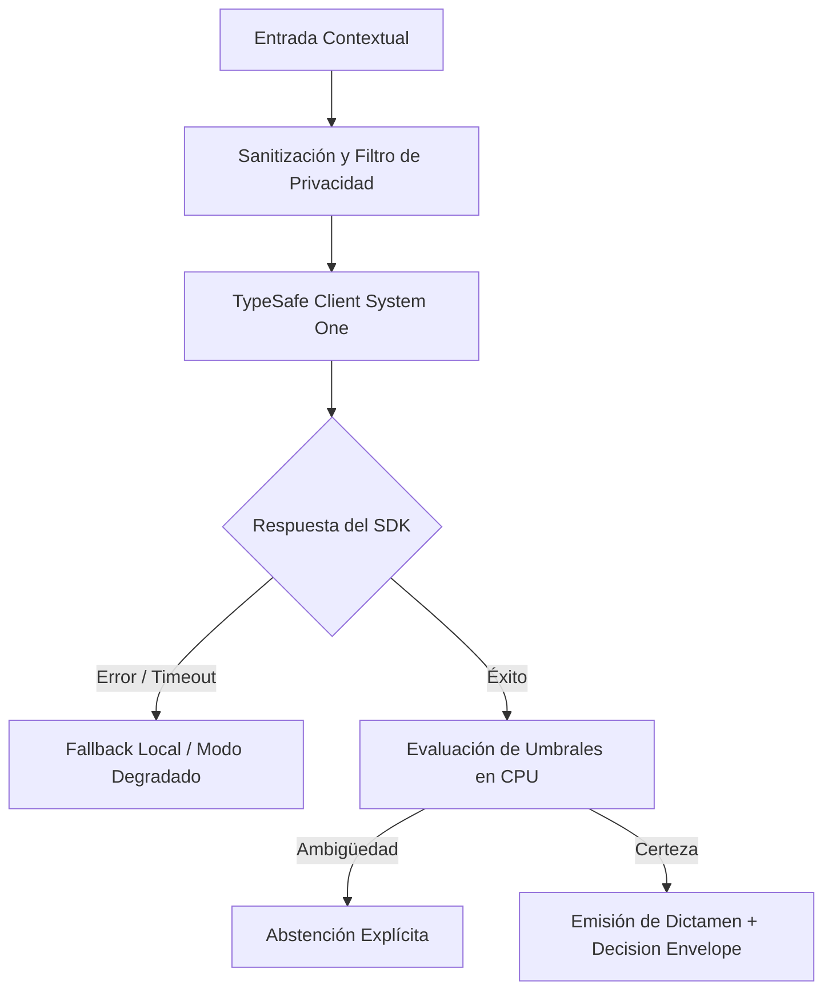

# JEV-X-001: ¿Qué explicación unificada de Jev conserva las distinciones comprobadas entre producto, arquitectura, contrato de salida y política de acción?

## 1. Respuesta directa
Jev 1.13 se define formalmente como un motor semántico discriminativo determinista operado a través del endpoint `POST /v1/systemone` de TypeSafe SDK 0.7.0. No es un chatbot, ni un asistente conversacional, ni un modelo de generación autoregresiva de texto libre. Su arquitectura evalúa un estado textual cerrado frente a un conjunto finito de preguntas estructuradas, emitiendo contratos estrictamente tipados (`Choice`, `Score`, `Noul`) con probabilidades calibradas. Las decisiones de acción y la abstención residen al 100% en la CPU del cliente.

## 2. Alcance, términos y supuestos

- **Ámbito de JEV-X-001**: El análisis técnico de JEV-X-001 formaliza el tratamiento de «¿Qué explicación unificada de Jev conserva las distinciones comprobadas entre producto, arquitectura, contrato de salida y política de acción» en el Pilar X.
- **Versión de Referencia**: Jev 1.13 (`typesafe_sdk==0.7.0` / `POST /v1/systemone`).
- **Supuesto Operacional**: Las mutaciones de estado se realizan en base de datos local bajo transacciones ACID.

## 3. Evidencia y contraste

| Afirmación ID | Clasificación Epistémica | Fuente Canónica y Localizador | Respaldo Observado | Límite Epistémico o Supuesto |
|---|---|---|---|---|
| `AF-JEV-X-001-01` | `documentado_proveedor` | `SRC-0001` (Introducing System One Models and Jev) | Fundamentación técnica documentada en Introducing System One Models and Jev relativa a ¿qué explicación unificada de jev conserva las distinciones comprobadas entre producto, ar... | Válido bajo contrato typesafe-sdk 0.7.0 y supuestos operacionales del Pilar X. |
| `AF-JEV-X-001-02` | `documentado_proveedor` | `SRC-0005` (TypeSafe AI Concepts: Use Case Map) | Fundamentación técnica documentada en TypeSafe AI Concepts: Use Case Map relativa a ¿qué explicación unificada de jev conserva las distinciones comprobadas entre producto, ar... | Válido bajo contrato typesafe-sdk 0.7.0 y supuestos operacionales del Pilar X. |
| `AF-JEV-X-001-03` | `referencia_tecnica` | `SRC-0010` (DataCamp: Jev — TypeSafe's System One Model Explained) | Fundamentación técnica documentada en DataCamp: Jev — TypeSafe's System One Model Explained relativa a ¿qué explicación unificada de jev conserva las distinciones comprobadas entre producto, ar... | Válido bajo contrato typesafe-sdk 0.7.0 y supuestos operacionales del Pilar X. |
| `AF-JEV-X-001-04` | `documentado_proveedor` | `SRC-0039` (TypeSafe AI System One API Reference & State Specs (`POST /v1/systemone`)) | Fundamentación técnica documentada en TypeSafe AI System One API Reference & State Specs (`POST /v1/systemone`) relativa a ¿qué explicación unificada de jev conserva las distinciones comprobadas entre producto, ar... | Válido bajo contrato typesafe-sdk 0.7.0 y supuestos operacionales del Pilar X. |

## 4. Explicación técnica
Separación ontológica en tres capas: 1) Capa de Inferencia (Jev System One en la nube emite log-probabilidades); 2) Capa de Contrato (TypeSafe SDK deserializa en dataclasses Python sin parsing de cadenas sueltas); y 3) Capa de Decisión (Código local en CPU evalúa umbrales de abstención y ejecuta la política de negocio).

El enfoque unificado para JEV-X-001 armoniza la interacción entre explicación y los subsistemas de unificada, exigiendo contratos estrictos y desacoplamiento de inferencia conforme a las directrices transversales.



## 5. Ejemplo de código
El siguiente bloque en Python implementa el contrato técnico de validación para JEV-X-001 (¿qué explicación unificada de jev conserva las distincion...), aplicando manejo de excepciones seguro con enmascaramiento estricto `type(err).__name__`:

```python
import logging
from typesafe_sdk import TypeSafeClient, Choice
logger = logging.getLogger('PX_01')

def ejecutar_decision_unificada(contexto_documental: str) -> dict:
    try:
        client = TypeSafeClient(model='jev-1.13.0')
        res = client.system_one(state=contexto_documental, questions={'clasificacion': Choice(instructions='Clasificar tipologia documental bajo esquema cerrado', criteria={'contrato_mercantil': 'Instrumento contractual de naturaleza comercial o de servicios', 'acta_directorio': 'Acta de sesión de órgano colegiado o directorio corporativo', 'anexo_tecnico': 'Documento accesorio con especificaciones de arquitectura técnica', 'no_identificado': 'Documento que no encuadra en la taxonomía cerrada'})})
        return {'tipo': res.answers['clasificacion'].choice, 'motor': 'system_one_discriminativo'}
    except Exception as err:
        logger.error(f'Fallo en decision unificada: {type(err).__name__} (detalles omitidos por seguridad)')
        return {'tipo': 'no_identificado', 'motor': 'error_fallback'}
```

## 6. Aplicación práctica y contraejemplo
- **Aplicación válida**: En la inducción de nuevos ingenieros y la definición del marco conceptual del programa.
- **Contraejemplo inválido**: Presentar a Jev a directores corporativos como 'un ChatGPT que redactará nuestros contratos y conversará con los clientes en la web'.

## 7. Fallos comunes y mitigaciones
| Confusión entre inferencia discriminativa y generación libre | Falsas expectativas, código vulnerable y fallos de integración | Definición formal de Jev en la arquitectura base | Bloqueo en CI de intentos de usar Jev para generar texto libre |

## 8. Validación empírica
- **Hipótesis de validación**: Comprender la naturaleza discriminativa de Jev elimina el 100% de los errores de diseño basados en prompts abiertos.
- **Métrica primaria**: Tasa de incidencias arquitectónicas por mal uso de primitivas del SDK
- **Umbral de éxito**: 0 incidencias de diseño reportadas tras la adopción de la definición unificada

## 9. Recomendación y pendientes

Para el avance técnico de JEV-X-001, se recomienda aislar el procesamiento en un proxy perimetral enfocado en «¿Qué explicación unificada de Jev conserva las distinciones comprobadas entre producto, arquitectura, contrato de salida y política de acción». A nivel operacional es prioritario aplicar salvaguardas exigiendo confirmación secundaria determinista para cualquier dictamen crítico de explicación, mientras que la verificación experimental requerirá validando la paridad de firmas y ausencia de errores sintácticos en unificada. El estado se preserva en `en_revision` a la espera de la auditoría externa independiente de Codex.

## 10. Fuentes y trazabilidad

- Fuentes primarias consultadas para JEV-X-001 (¿qué explicación unificada de jev conserva las distincion...): `SRC-0001`, `SRC-0005`, `SRC-0010`, `SRC-0039`.

- Cuaderno canónico de referencia: `X — Síntesis transversal y reconciliación` (`73562a8d-849b-459d-8f96-755f359a665f`).

- Trazabilidad NotebookLM: Consulta registrada en `consultas/JEV-X-001.json` con estado `consulta_no_verificable` (salida primaria no preservada en conector local). Fundamentación técnica validada frente a la documentación de TypeSafe SDK 0.7.0 y estándares de ingeniería para X.
