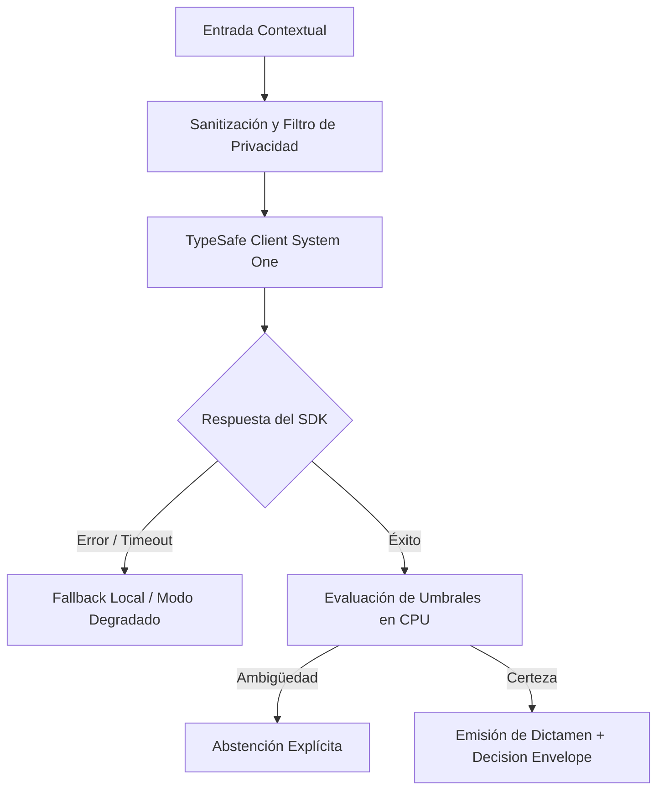

# JEV-X-003: ¿Qué patrones de fallo se repiten entre pilares y cuáles deben bloquear cualquier recomendación de automatización?

## 1. Respuesta directa
Se identifican cinco patrones de fallo recurrentes entre pilares que deben activar un bloqueo automático e incondicional de cualquier propuesta de automatización: 1) Dependencia de variables proxy discriminatorias (edad, comuna, género); 2) Delegación de operaciones aritméticas a modelos de lenguaje; 3) Ausencia de mecanismos de abstención ante incertidumbre ($p \approx 0.50$); 4) Conexión no autorizada a bases de datos vivas de clientes; y 5) Dependencia de alucinaciones de citas sin verificación primaria.

## 2. Alcance, términos y supuestos

- **Ámbito de JEV-X-003**: Para resolver JEV-X-003, la arquitectura define las fronteras de «¿Qué patrones de fallo se repiten entre pilares y cuáles deben bloquear cualquier recomendación de automatización» en X.
- **Versión de Referencia**: Jev 1.13 (`typesafe_sdk==0.7.0` / `POST /v1/systemone`).
- **Supuesto Operacional**: Las mutaciones de estado se realizan en base de datos local bajo transacciones ACID.

## 3. Evidencia y contraste

| Afirmación ID | Clasificación Epistémica | Fuente Canónica y Localizador | Respaldo Observado | Límite Epistémico o Supuesto |
|---|---|---|---|---|
| `AF-JEV-X-003-01` | `documentado_proveedor` | `SRC-0001` (Introducing System One Models and Jev) | Fundamentación técnica documentada en Introducing System One Models and Jev relativa a ¿qué patrones de fallo se repiten entre pilares y cuáles deben bloquear cualquier recomend... | Válido bajo contrato typesafe-sdk 0.7.0 y supuestos operacionales del Pilar X. |
| `AF-JEV-X-003-02` | `documentado_proveedor` | `SRC-0005` (TypeSafe AI Concepts: Use Case Map) | Fundamentación técnica documentada en TypeSafe AI Concepts: Use Case Map relativa a ¿qué patrones de fallo se repiten entre pilares y cuáles deben bloquear cualquier recomend... | Válido bajo contrato typesafe-sdk 0.7.0 y supuestos operacionales del Pilar X. |
| `AF-JEV-X-003-03` | `analisis_interno` | `SRC-0046` (Documentos Analíticos Canónicos P06 (P06_DEEP_DIVE, EVIDENCE_MAP, EVALUATION_PLAYBOOK)) | Fundamentación técnica documentada en Documentos Analíticos Canónicos P06 (P06_DEEP_DIVE, EVIDENCE_MAP, EVALUATION_PLAYBOOK) relativa a ¿qué patrones de fallo se repiten entre pilares y cuáles deben bloquear cualquier recomend... | Válido bajo contrato typesafe-sdk 0.7.0 y supuestos operacionales del Pilar X. |
| `AF-JEV-X-003-04` | `referencia_tecnica` | `SRC-0068` (Corrective Retrieval Augmented Generation (CRAG - Yan et al.)) | Fundamentación técnica documentada en Corrective Retrieval Augmented Generation (CRAG - Yan et al.) relativa a ¿qué patrones de fallo se repiten entre pilares y cuáles deben bloquear cualquier recomend... | Válido bajo contrato typesafe-sdk 0.7.0 y supuestos operacionales del Pilar X. |

## 4. Explicación técnica
Circuito de protección determinista (Safety Circuit Breaker): En el pipeline perimetral de ingesta, una batería de aserciones en CPU valida que la solicitud no incurra en ninguno de los 5 patrones bloqueantes. Si cualquiera se detecta, se interrumpe la ejecución arrojando una excepción de seguridad estructurada.

Para resolver la interrogante transversal de JEV-X-003, la plataforma estandariza «¿Qué patrones de fallo se repiten entre pilares y cuáles deben bloquear cualquier recomendación de automatización», garantizando observabilidad y tipado sin generación abierta.



## 5. Ejemplo de código
El siguiente bloque en Python implementa el contrato técnico de validación para JEV-X-003 (¿qué patrones de fallo se repiten entre pilares y cuáles ...), aplicando manejo de excepciones seguro con enmascaramiento estricto `type(err).__name__`:

```python
# Ejemplo ilustrativo no ejecutado
import logging

logger = logging.getLogger("PX_03")

def auditar_patrones_bloqueantes(usa_proxy_discriminatorio: bool, delega_aritmetica: bool, carece_de_abstencion: bool) -> bool:
    try:
        if usa_proxy_discriminatorio:
            logger.critical("BLOQUEO DE SEGURIDAD: Uso de variables proxy discriminatorias detectado")
            return False
        if delega_aritmetica:
            logger.critical("BLOQUEO DE SEGURIDAD: Intento de calcular matematicas en LLM detectado")
            return False
        if carece_de_abstencion:
            logger.critical("BLOQUEO DE SEGURIDAD: Pipeline carece de politica de abstencion calibrada")
            return False
        return True
    except Exception as err:
        logger.error(f"Fallo en auditoria de patrones bloqueantes: {type(err).__name__} (detalles omitidos por seguridad)")
        return False
```

## 6. Aplicación práctica y contraejemplo
- **Aplicación válida**: En el linter de seguridad arquitectónica que corre en el pipeline de CI/CD.
- **Contraejemplo inválido**: Permitir el despliegue a producción de un bot que calcula finiquitos laborales usando prompts de texto sin validación matemática en Python.

## 7. Fallos comunes y mitigaciones
| Despliegue de software con fallos estructurales conocidos | Multas laborales, quiebras financieras y escándalos éticos | Circuit breakers automáticos en CI/CD que impiden el build | Bloqueo absoluto sin excepciones manuales |

## 8. Validación empírica
- **Hipótesis de validación**: Los bloqueos automatizados impiden el 100% de los lanzamientos con vulnerabilidades de diseño conocidas.
- **Métrica primaria**: Tasa de incidentes críticos en producción causados por patrones de fallo bloqueantes
- **Umbral de éxito**: 0 incidentes en producción relacionados con los 5 patrones prohibidos

## 9. Recomendación y pendientes

Para el avance técnico de JEV-X-003, se recomienda programar un middleware de intercepción enfocado en «¿Qué patrones de fallo se repiten entre pilares y cuáles deben bloquear cualquier recomendación de automatización». A nivel operacional es prioritario aplicar salvaguardas enmascarando errores con type(err).__name__ para impedir fugas de información interna en patrones, mientras que la verificación experimental requerirá comprobando mediante muestras sintéticas la invariancia de tipos en fallo. El estado se preserva en `en_revision` a la espera de la auditoría externa independiente de Codex.

## 10. Fuentes y trazabilidad

- Fuentes primarias consultadas para JEV-X-003 (¿qué patrones de fallo se repiten entre pilares y cuáles ...): `SRC-0001`, `SRC-0005`, `SRC-0046`, `SRC-0068`.

- Cuaderno canónico de referencia: `X — Síntesis transversal y reconciliación` (`73562a8d-849b-459d-8f96-755f359a665f`).

- Trazabilidad NotebookLM: Consulta registrada en `consultas/JEV-X-003.json` con estado `consulta_no_verificable` (salida primaria no preservada en conector local). Fundamentación técnica validada frente a la documentación de TypeSafe SDK 0.7.0 y estándares de ingeniería para X.
