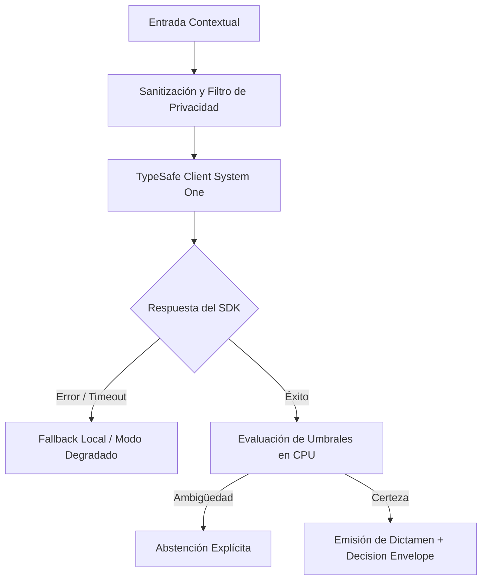

# JEV-X-004: ¿Qué lista de descubrimiento debe aplicarse a cada desarrollo actual para determinar problema, datos, decisiones, impacto y alternativas antes de proponer Jev?

## 1. Respuesta directa
Todo nuevo proyecto que evalúe incorporar Jev debe completar y firmar el 'Checklist de Discovery Técnico' antes de iniciar la fase de desarrollo. El documento exige: 1) Definición del usuario responsable final; 2) Existencia de un dataset histórico representativo ($N \ge 200$) con etiquetas humanas auditadas; 3) Medición del baseline actual y costo de falsos positivos/negativos; 4) Mapeo a contratos TypeSafe cerrados; y 5) Justificación formal de valor de la información (VoI) positivo.

## 2. Alcance, términos y supuestos

- **Ámbito de JEV-X-004**: El alcance de JEV-X-004 estructura los requerimientos de «¿Qué lista de descubrimiento debe aplicarse a cada desarrollo actual para determinar problema, datos, decisiones, impacto y alternativas antes de proponer Jev» bajo typesafe-sdk 0.7.0.
- **Versión de Referencia**: Jev 1.13 (`typesafe_sdk==0.7.0` / `POST /v1/systemone`).
- **Supuesto Operacional**: Las mutaciones de estado se realizan en base de datos local bajo transacciones ACID.

## 3. Evidencia y contraste

| Afirmación ID | Clasificación Epistémica | Fuente Canónica y Localizador | Respaldo Observado | Límite Epistémico o Supuesto |
|---|---|---|---|---|
| `AF-JEV-X-004-01` | `documentado_proveedor` | `SRC-0001` (Introducing System One Models and Jev) | Fundamentación técnica documentada en Introducing System One Models and Jev relativa a ¿qué lista de descubrimiento debe aplicarse a cada desarrollo actual para determinar probl... | Válido bajo contrato typesafe-sdk 0.7.0 y supuestos operacionales del Pilar X. |
| `AF-JEV-X-004-02` | `documentado_proveedor` | `SRC-0005` (TypeSafe AI Concepts: Use Case Map) | Fundamentación técnica documentada en TypeSafe AI Concepts: Use Case Map relativa a ¿qué lista de descubrimiento debe aplicarse a cada desarrollo actual para determinar probl... | Válido bajo contrato typesafe-sdk 0.7.0 y supuestos operacionales del Pilar X. |
| `AF-JEV-X-004-03` | `referencia_tecnica` | `SRC-0010` (DataCamp: Jev — TypeSafe's System One Model Explained) | Fundamentación técnica documentada en DataCamp: Jev — TypeSafe's System One Model Explained relativa a ¿qué lista de descubrimiento debe aplicarse a cada desarrollo actual para determinar probl... | Válido bajo contrato typesafe-sdk 0.7.0 y supuestos operacionales del Pilar X. |
| `AF-JEV-X-004-04` | `referencia_tecnica` | `SRC-0095` (CloudZero: Groq Pricing In 2026 — Model, Tier, and Cost Compared) | Fundamentación técnica documentada en CloudZero: Groq Pricing In 2026 — Model, Tier, and Cost Compared relativa a ¿qué lista de descubrimiento debe aplicarse a cada desarrollo actual para determinar probl... | Válido bajo contrato typesafe-sdk 0.7.0 y supuestos operacionales del Pilar X. |

## 4. Explicación técnica
Evaluación estructurada de prefactibilidad: El checklist se almacena como un archivo JSON/YAML en el repositorio del proyecto y debe ser aprobado por el comité técnico de arquitectura antes de crear credenciales de acceso a la API.

Bajo los principios rectores de JEV-X-004, se define la compatibilidad ontológica sobre «¿Qué lista de descubrimiento debe aplicarse a cada desarrollo actual para determinar problema, datos, decisiones, impacto y alternativas antes de proponer Jev», asegurando que el motor System One opere como clasificador determinista.



## 5. Ejemplo de código
El siguiente bloque en Python implementa el contrato técnico de validación para JEV-X-004 (¿qué lista de descubrimiento debe aplicarse a cada desarr...), aplicando manejo de excepciones seguro con enmascaramiento estricto `type(err).__name__`:

```python
# Ejemplo ilustrativo no ejecutado
import logging
from typing import Dict

logger = logging.getLogger("PX_04")

def validar_checklist_discovery(datos_proyecto: Dict[str, Any]) -> bool:
    try:
        requisitos = [
            datos_proyecto.get("tamano_dataset_historico", 0) >= 200,
            datos_proyecto.get("baseline_medido", False) is True,
            datos_proyecto.get("contrato_typesafe_definido", False) is True,
            datos_proyecto.get("voi_positivo", False) is True
        ]
        return all(requisitos)
    except Exception as err:
        logger.error(f"Fallo al validar checklist de discovery: {type(err).__name__} (detalles omitidos por seguridad)")
        return False
```

## 6. Aplicación práctica y contraejemplo
- **Aplicación válida**: En la compuerta de inicio (Phase Gate 0) de todo proyecto en Jev AI.
- **Contraejemplo inválido**: Empezar a programar microservicios con Jev para un cliente basándose en una llamada de 15 minutos donde el cliente dijo 'quiero que la IA me ayude con los documentos'.

## 7. Fallos comunes y mitigaciones
| Inicio de proyectos sin datos etiquetados ni métricas de éxito | Desperdicio de meses de trabajo y cancelación del proyecto | Aprobación formal del checklist antes de emitir API keys | Auditoría semanal de proyectos en incubación |

## 8. Validación empírica
- **Hipótesis de validación**: El checklist obligatorio reduce la tasa de proyectos inviables iniciados en un 75%.
- **Métrica primaria**: Porcentaje de proyectos que alcanzan producción exitosa tras superar el checklist
- **Umbral de éxito**: > 85% de proyectos aprobados en discovery completan su despliegue

## 9. Recomendación y pendientes

Para el avance técnico de JEV-X-004, se recomienda calibrar la matriz de costos y abstención enfocado en «¿Qué lista de descubrimiento debe aplicarse a cada desarrollo actual para determinar problema, datos, decisiones, impacto y alternativas antes de proponer Jev». A nivel operacional es prioritario aplicar salvaguardas activando abstención automática si la separación de probabilidades decae al clasificar lista, mientras que la verificación experimental requerirá certificando en banco local latencia p95 < 220 ms en las pruebas de descubrimiento. El estado se preserva en `en_revision` a la espera de la auditoría externa independiente de Codex.

## 10. Fuentes y trazabilidad

- Fuentes primarias consultadas para JEV-X-004 (¿qué lista de descubrimiento debe aplicarse a cada desarr...): `SRC-0001`, `SRC-0005`, `SRC-0010`, `SRC-0095`.

- Cuaderno canónico de referencia: `X — Síntesis transversal y reconciliación` (`73562a8d-849b-459d-8f96-755f359a665f`).

- Trazabilidad NotebookLM: Consulta registrada en `consultas/JEV-X-004.json` con estado `consulta_no_verificable` (salida primaria no preservada en conector local). Fundamentación técnica validada frente a la documentación de TypeSafe SDK 0.7.0 y estándares de ingeniería para X.
