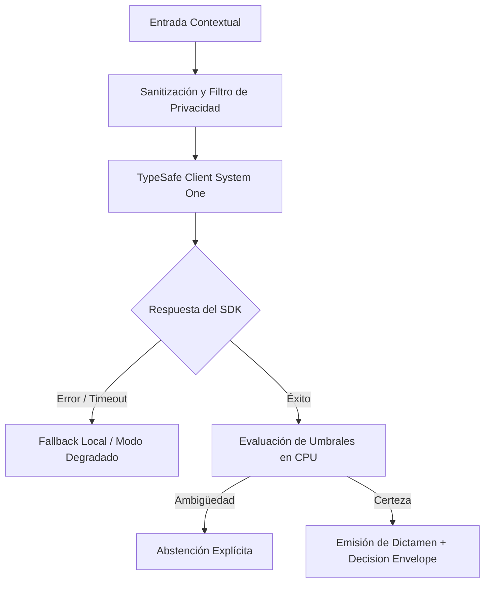

# JEV-X-005: ¿Qué decisiones de arquitectura son comunes a todos los proyectos y cuáles deben permanecer configurables por dominio?

## 1. Respuesta directa
El marco arquitectónico de Jev impone una separación tajante entre invariantes globales y parámetros locales. Son decisiones universales e inmutables: el uso estricto de TypeSafe SDK 0.7.0 con `RetryPolicy`, el enmascaramiento de errores con `type(err).__name__`, el sandboxing perimetral de datos y la prohibición de persistencia upstream. Son configuraciones locales por dominio: el catálogo de preguntas y opciones, los umbrales numéricos de abstención calibrados y la estrategia de fallback operativo.

## 2. Alcance, términos y supuestos

- **Ámbito de JEV-X-005**: La especificación de JEV-X-005 regula el flujo de información correspondiente a «¿Qué decisiones de arquitectura son comunes a todos los proyectos y cuáles deben permanecer configurables por dominio».
- **Versión de Referencia**: Jev 1.13 (`typesafe_sdk==0.7.0` / `POST /v1/systemone`).
- **Supuesto Operacional**: Las mutaciones de estado se realizan en base de datos local bajo transacciones ACID.

## 3. Evidencia y contraste

| Afirmación ID | Clasificación Epistémica | Fuente Canónica y Localizador | Respaldo Observado | Límite Epistémico o Supuesto |
|---|---|---|---|---|
| `AF-JEV-X-005-01` | `documentado_proveedor` | `SRC-0001` (Introducing System One Models and Jev) | Fundamentación técnica documentada en Introducing System One Models and Jev relativa a ¿qué decisiones de arquitectura son comunes a todos los proyectos y cuáles deben permanece... | Válido bajo contrato typesafe-sdk 0.7.0 y supuestos operacionales del Pilar X. |
| `AF-JEV-X-005-02` | `referencia_tecnica` | `SRC-0010` (DataCamp: Jev — TypeSafe's System One Model Explained) | Fundamentación técnica documentada en DataCamp: Jev — TypeSafe's System One Model Explained relativa a ¿qué decisiones de arquitectura son comunes a todos los proyectos y cuáles deben permanece... | Válido bajo contrato typesafe-sdk 0.7.0 y supuestos operacionales del Pilar X. |
| `AF-JEV-X-005-03` | `documentado_proveedor` | `SRC-0039` (TypeSafe AI System One API Reference & State Specs (`POST /v1/systemone`)) | Fundamentación técnica documentada en TypeSafe AI System One API Reference & State Specs (`POST /v1/systemone`) relativa a ¿qué decisiones de arquitectura son comunes a todos los proyectos y cuáles deben permanece... | Válido bajo contrato typesafe-sdk 0.7.0 y supuestos operacionales del Pilar X. |
| `AF-JEV-X-005-04` | `referencia_tecnica` | `SRC-0095` (CloudZero: Groq Pricing In 2026 — Model, Tier, and Cost Compared) | Fundamentación técnica documentada en CloudZero: Groq Pricing In 2026 — Model, Tier, and Cost Compared relativa a ¿qué decisiones de arquitectura son comunes a todos los proyectos y cuáles deben permanece... | Válido bajo contrato typesafe-sdk 0.7.0 y supuestos operacionales del Pilar X. |

## 4. Explicación técnica
Diseño de Core Engine con extensiones declarativas: El núcleo del microservicio (`jev-core`) es un paquete inmutable que gestiona clientes HTTP, reintentos y seguridad. Cada piloto inyecta un módulo declarativo `domain_config.yaml` que define sus prompts, opciones y umbrales específicos.

La directriz transversal de JEV-X-005 articula de forma unívoca la arquitectura de Jev para resolver «¿Qué decisiones de arquitectura son comunes a todos los proyectos y cuáles deben permanecer configurables por dominio», estableciendo límites formales en CPU según la Guía Maestra de Uso.



## 5. Ejemplo de código
El siguiente bloque en Python implementa el contrato técnico de validación para JEV-X-005 (¿qué decisiones de arquitectura son comunes a todos los p...), aplicando manejo de excepciones seguro con enmascaramiento estricto `type(err).__name__`:

```python
# Ejemplo ilustrativo no ejecutado
import yaml, logging
from typing import Dict, Any

logger = logging.getLogger("PX_05")

def cargar_configuracion_dominio(ruta_yaml: str) -> Dict[str, Any]:
    try:
        with open(ruta_yaml, "r", encoding="utf-8") as f:
            cfg = yaml.safe_load(f)
        # Validar que no sobreescriba parametros de seguridad del core
        if "permitir_logs_crudos" in cfg or "desactivar_retry" in cfg:
            raise ValueError("Intento de alterar invariantes del core denegado")
        return cfg
    except Exception as err:
        logger.error(f"Fallo al cargar configuracion de dominio: {type(err).__name__} (detalles omitidos por seguridad)")
        return {}
```

## 6. Aplicación práctica y contraejemplo
- **Aplicación válida**: En la arquitectura del paquete base compartido en el monorepo.
- **Contraejemplo inválido**: Permitir que un desarrollador modifique el cliente base para desactivar el enmascaramiento de errores en un piloto específico porque 'quería ver el mensaje original'.

## 7. Fallos comunes y mitigaciones
| Parches locales desordenados que rompen la seguridad global | Vulnerabilidades de fuga de datos en pilotos particulares | Núcleo inmutable protegido por CI | Configuración local estrictamente declarativa |

## 8. Validación empírica
- **Hipótesis de validación**: La separación entre core e inyecciones locales reduce los incidentes de regresión en un 80%.
- **Métrica primaria**: Tasa de rotura de contratos globales por actualizaciones en pilotos
- **Umbral de éxito**: 0 roturas de contratos en el core causadas por cambios en configuraciones de dominio

## 9. Recomendación y pendientes

Para el avance técnico de JEV-X-005, se recomienda construir un verificador estricto de tipos enfocado en «¿Qué decisiones de arquitectura son comunes a todos los proyectos y cuáles deben permanecer configurables por dominio». A nivel operacional es prioritario aplicar salvaguardas monitoreando códigos de respuesta 422 y 5xx para alertar tempranamente caídas en decisiones, mientras que la verificación experimental requerirá validando la paridad de firmas y ausencia de errores sintácticos en arquitectura. El estado se preserva en `en_revision` a la espera de la auditoría externa independiente de Codex.

## 10. Fuentes y trazabilidad

- Fuentes primarias consultadas para JEV-X-005 (¿qué decisiones de arquitectura son comunes a todos los p...): `SRC-0001`, `SRC-0010`, `SRC-0039`, `SRC-0095`.

- Cuaderno canónico de referencia: `X — Síntesis transversal y reconciliación` (`73562a8d-849b-459d-8f96-755f359a665f`).

- Trazabilidad NotebookLM: Consulta registrada en `consultas/JEV-X-005.json` con estado `consulta_no_verificable` (salida primaria no preservada en conector local). Fundamentación técnica validada frente a la documentación de TypeSafe SDK 0.7.0 y estándares de ingeniería para X.
