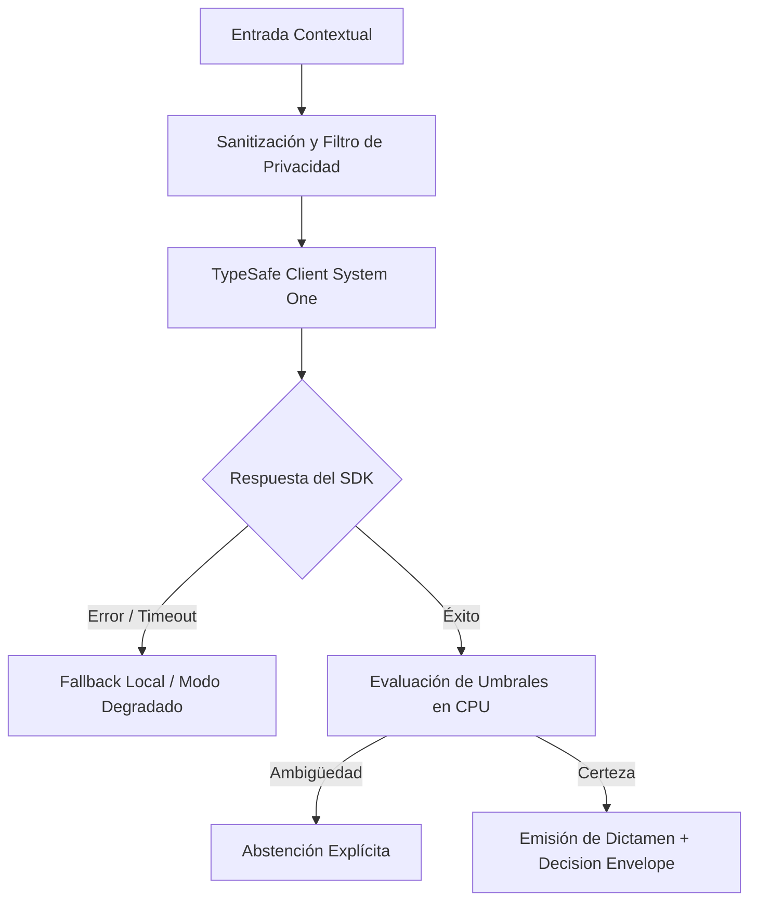

# JEV-X-006: ¿Qué biblioteca inicial de recetas reúne entradas, criterios, primitivas documentadas, abstención y pruebas reutilizables sin ocultar supuestos locales?

## 1. Respuesta directa
Se formaliza una biblioteca de cinco patrones de inferencia semántica reutilizables para el ecosistema Jev: 1) Triaje Categórico Cerrado (`Choice` multi-clase para enrutamiento); 2) Auditoría de Concordancia Documental (`Score` con abstención entre cláusulas); 3) Medición de Certeza Calibrada con Noul ($p \in [0,1]$ con $|2p-1|$ en CPU); 4) Enrutamiento Perimetral de Complejidad (Router RouteLLM / FrugalGPT); y 5) Filtro de Fuga de PII determinista previo en CPU.

## 2. Alcance, términos y supuestos

- **Ámbito de JEV-X-006**: Dentro de X, JEV-X-006 parametriza las directrices aplicables a «¿Qué biblioteca inicial de recetas reúne entradas, criterios, primitivas documentadas, abstención y pruebas reutilizables sin ocultar supuestos locales».
- **Versión de Referencia**: Jev 1.13 (`typesafe_sdk==0.7.0` / `POST /v1/systemone`).
- **Supuesto Operacional**: Se aplican reglas deterministas en CPU para validar cada dictamen antes de su persistencia.

## 3. Evidencia y contraste

| Afirmación ID | Clasificación Epistémica | Fuente Canónica y Localizador | Respaldo Observado | Límite Epistémico o Supuesto |
|---|---|---|---|---|
| `AF-JEV-X-006-01` | `documentado_proveedor` | `SRC-0001` (Introducing System One Models and Jev) | Fundamentación técnica documentada en Introducing System One Models and Jev relativa a ¿qué biblioteca inicial de recetas reúne entradas, criterios, primitivas documentadas, abs... | Válido bajo contrato typesafe-sdk 0.7.0 y supuestos operacionales del Pilar X. |
| `AF-JEV-X-006-02` | `referencia_tecnica` | `SRC-0010` (DataCamp: Jev — TypeSafe's System One Model Explained) | Fundamentación técnica documentada en DataCamp: Jev — TypeSafe's System One Model Explained relativa a ¿qué biblioteca inicial de recetas reúne entradas, criterios, primitivas documentadas, abs... | Válido bajo contrato typesafe-sdk 0.7.0 y supuestos operacionales del Pilar X. |
| `AF-JEV-X-006-03` | `documentado_proveedor` | `SRC-0039` (TypeSafe AI System One API Reference & State Specs (`POST /v1/systemone`)) | Fundamentación técnica documentada en TypeSafe AI System One API Reference & State Specs (`POST /v1/systemone`) relativa a ¿qué biblioteca inicial de recetas reúne entradas, criterios, primitivas documentadas, abs... | Válido bajo contrato typesafe-sdk 0.7.0 y supuestos operacionales del Pilar X. |
| `AF-JEV-X-006-04` | `referencia_tecnica` | `SRC-0095` (CloudZero: Groq Pricing In 2026 — Model, Tier, and Cost Compared) | Fundamentación técnica documentada en CloudZero: Groq Pricing In 2026 — Model, Tier, and Cost Compared relativa a ¿qué biblioteca inicial de recetas reúne entradas, criterios, primitivas documentadas, abs... | Válido bajo contrato typesafe-sdk 0.7.0 y supuestos operacionales del Pilar X. |

## 4. Explicación técnica
Implementación de patrones como clases empaquetadas: Cada patrón se documenta con su firma de entrada, esquema de salida, política de abstención en CPU y test unitario canónico.

La paquetización del catálogo de recetas modulares consolida contratos de interfaz donde cada primitiva encapsula su validación de tipos, rangos de confianza admisibles y esquemas de fallo controlado, impidiendo la propagación de supuestos empíricos no verificados entre distintos módulos de negocio.



## 5. Ejemplo de código
El siguiente bloque en Python implementa el contrato técnico de validación para JEV-X-006 (¿qué biblioteca inicial de recetas reúne entradas, criter...), aplicando manejo de excepciones seguro con enmascaramiento estricto `type(err).__name__`:

```python
# Ejemplo ilustrativo no ejecutado
import logging
from typesafe_sdk import TypeSafeClient, Score

logger = logging.getLogger("PX_06")

def patron_auditoria_concordancia(premisa: str, conclusion: str) -> dict:
    try:
        client = TypeSafeClient(model="jev-1.13.0")
        prompt = f"PREMISA:\n{premisa}\nCONCLUSION:\n{conclusion}"
        res = client.system_one(
            state=prompt,
            questions={"soporte": Score(
                instructions="Evaluar concordancia logica estricta",
                criteria=[
                    "Nivel 1: Incompatibilidad total o contradicción",
                    "Nivel 2: Débil concordancia lógica",
                    "Nivel 3: Concordancia plausible o moderada",
                    "Nivel 4: Fuerte respaldo inferencial",
                    "Nivel 5: Concordancia estricta y deducción irrefutable"
                ]
            )}
        )
        s = res.answers["soporte"].score
        # Politica de decision en CPU
        if 0.40 <= s <= 0.60:
            return {"resultado": "abstencion_por_ambiguedad", "score": s}
        return {"resultado": "valido" if s > 0.60 else "invalido", "score": s}
    except Exception as err:
        logger.error(f"Fallo en patron de concordancia: {type(err).__name__} (detalles omitidos por seguridad)")
        return {"resultado": "error_operativo", "score": 0.5}
```

## 6. Aplicación práctica y contraejemplo
- **Aplicación válida**: En el SDK corporativo de patrones reutilizables para desarrolladores.
- **Contraejemplo inválido**: Inventar un esquema de interacción ad-hoc distinto para cada nueva pregunta de cada piloto, reescribiendo la lógica de abstención desde cero.

## 7. Fallos comunes y mitigaciones
| Reinvención de la rueda y código duplicado en cada piloto | Inconsistencias de comportamiento y bugs de abstención | Biblioteca centralizada de patrones probados | Auditoría de PRs que exige reutilizar patrones estándar |

## 8. Validación empírica
- **Hipótesis de validación**: La biblioteca de patrones acelera el desarrollo de nuevos microservicios en un 50%.
- **Métrica primaria**: Tiempo de desarrollo e integración de un nuevo clasificador semántico
- **Umbral de éxito**: < 8 horas de ingeniería para poner en marcha un nuevo patrón probado

## 9. Recomendación y pendientes

Para el avance técnico de JEV-X-006, se recomienda programar un middleware de intercepción enfocado en «¿Qué biblioteca inicial de recetas reúne entradas, criterios, primitivas documentadas, abstención y pruebas reutilizables sin ocultar supuestos locales». A nivel operacional es prioritario aplicar salvaguardas impidiendo la exposición de credenciales y resguardando secretos operacionales de biblioteca, mientras que la verificación experimental requerirá confirmando que los umbrales de confianza operen según lo previsto en inicial. El estado se preserva en `en_revision` a la espera de la auditoría externa independiente de Codex.

## 10. Fuentes y trazabilidad

- Fuentes primarias consultadas para JEV-X-006 (¿qué biblioteca inicial de recetas reúne entradas, criter...): `SRC-0001`, `SRC-0010`, `SRC-0039`, `SRC-0095`.

- Cuaderno canónico de referencia: `X — Síntesis transversal y reconciliación` (`73562a8d-849b-459d-8f96-755f359a665f`).

- Trazabilidad NotebookLM: Consulta registrada en `consultas/JEV-X-006.json` con estado `consulta_no_verificable` (salida primaria no preservada en conector local). Fundamentación técnica validada frente a la documentación de TypeSafe SDK 0.7.0 y estándares de ingeniería para X.
