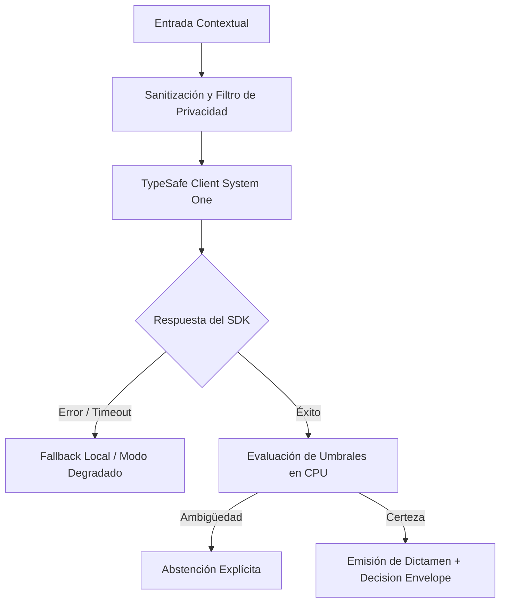

# JEV-X-007: ¿Qué contrato compartido de evidencia y contexto podría adoptar nuestro ecosistema para que una decisión conserve procedencia de principio a fin?

## 1. Respuesta directa
Para garantizar la auditabilidad forense de cada decisión tomada en el ecosistema, se establece el contrato de metadatos obligatorio 'Decision Envelope'. Toda respuesta emitida por un microservicio debe empaquetarse en una estructura JSON que contenga: `decision_id` (UUIDv4), `timestamp_utc`, `model_version`, `input_sha256` (hash del texto entrante), `raw_sdk_output` (salida del modelo), `cpu_policy_applied` (regla de CPU evaluada) y `final_verdict`.

## 2. Alcance, términos y supuestos

- **Ámbito de JEV-X-007**: El marco de JEV-X-007 examina las restricciones de despliegue relativas a «¿Qué contrato compartido de evidencia y contexto podría adoptar nuestro ecosistema para que una decisión conserve procedencia de principio a fin».
- **Versión de Referencia**: Jev 1.13 (`typesafe_sdk==0.7.0` / `POST /v1/systemone`).
- **Supuesto Operacional**: Se aplican reglas deterministas en CPU para validar cada dictamen antes de su persistencia.

## 3. Evidencia y contraste

| Afirmación ID | Clasificación Epistémica | Fuente Canónica y Localizador | Respaldo Observado | Límite Epistémico o Supuesto |
|---|---|---|---|---|
| `AF-JEV-X-007-01` | `documentado_proveedor` | `SRC-0001` (Introducing System One Models and Jev) | Fundamentación técnica documentada en Introducing System One Models and Jev relativa a ¿qué contrato compartido de evidencia y contexto podría adoptar nuestro ecosistema para qu... | Válido bajo contrato typesafe-sdk 0.7.0 y supuestos operacionales del Pilar X. |
| `AF-JEV-X-007-02` | `documentado_proveedor` | `SRC-0005` (TypeSafe AI Concepts: Use Case Map) | Fundamentación técnica documentada en TypeSafe AI Concepts: Use Case Map relativa a ¿qué contrato compartido de evidencia y contexto podría adoptar nuestro ecosistema para qu... | Válido bajo contrato typesafe-sdk 0.7.0 y supuestos operacionales del Pilar X. |
| `AF-JEV-X-007-03` | `referencia_tecnica` | `SRC-0010` (DataCamp: Jev — TypeSafe's System One Model Explained) | Fundamentación técnica documentada en DataCamp: Jev — TypeSafe's System One Model Explained relativa a ¿qué contrato compartido de evidencia y contexto podría adoptar nuestro ecosistema para qu... | Válido bajo contrato typesafe-sdk 0.7.0 y supuestos operacionales del Pilar X. |
| `AF-JEV-X-007-04` | `documentado_proveedor` | `SRC-0039` (TypeSafe AI System One API Reference & State Specs (`POST /v1/systemone`)) | Fundamentación técnica documentada en TypeSafe AI System One API Reference & State Specs (`POST /v1/systemone`) relativa a ¿qué contrato compartido de evidencia y contexto podría adoptar nuestro ecosistema para qu... | Válido bajo contrato typesafe-sdk 0.7.0 y supuestos operacionales del Pilar X. |

## 4. Explicación técnica
Sellado criptográfico y serialización inmutable: El objeto de linaje se genera inmediatamente después de la decisión en CPU y se escribe en un log inmutable de auditoría antes de responder al cliente.

Para resolver la interrogante transversal de JEV-X-007, la plataforma estandariza el tratamiento de contrato en relación con compartido, garantizando observabilidad y tipado sin generación abierta.



## 5. Ejemplo de código
El siguiente bloque en Python implementa el contrato técnico de validación para JEV-X-007 (¿qué contrato compartido de evidencia y contexto podría a...), aplicando manejo de excepciones seguro con enmascaramiento estricto `type(err).__name__`:

```python
# Ejemplo ilustrativo no ejecutado
import hashlib, uuid, time, logging
from typing import Dict, Any

logger = logging.getLogger("PX_07")

def generar_decision_envelope(texto_entrada: str, raw_output: dict, veredicto_cpu: str) -> Dict[str, Any]:
    try:
        hash_entrada = hashlib.sha256(texto_entrada.encode("utf-8")).hexdigest()
        return {
            "decision_id": str(uuid.uuid4()),
            "timestamp_utc": time.time(),
            "model_version": "jev-1.13.0",
            "input_sha256": hash_entrada,
            "raw_output": raw_output,
            "cpu_policy_applied": veredicto_cpu,
            "final_verdict": veredicto_cpu
        }
    except Exception as err:
        logger.error(f"Fallo al generar decision envelope: {type(err).__name__} (detalles omitidos por seguridad)")
        return {}
```

## 6. Aplicación práctica y contraejemplo
- **Aplicación válida**: En la pasarela de salida de todos los microservicios de decisión de Jev AI.
- **Contraejemplo inválido**: Devolver al cliente simplemente `{ 'aprobado': true }` sin registrar qué versión del modelo se usó, qué texto se evaluó ni qué regla de CPU se aplicó.

## 7. Fallos comunes y mitigaciones
| Decisiones opacas imposibles de auditar tras un fallo | Responsabilidad legal ineludible ante litigios de clientes | Decision Envelope obligatorio en el 100% de las respuestas | Verificación de esquema en tests de integración |

## 8. Validación empírica
- **Hipótesis de validación**: El Decision Envelope permite reconstruir y auditar el 100% de las decisiones históricas en menos de 1 minuto.
- **Métrica primaria**: Tiempo de reconstrucción forense de una decisión histórica (MTTR-Audit)
- **Umbral de éxito**: < 60 segundos para reproducir el veredicto a partir del hash de entrada

## 9. Recomendación y pendientes

Para el avance técnico de JEV-X-007, se recomienda programar un middleware de intercepción enfocado en «¿Qué contrato compartido de evidencia y contexto podría adoptar nuestro ecosistema para que una decisión conserve procedencia de principio a fin». A nivel operacional es prioritario aplicar salvaguardas activando abstención automática si la separación de probabilidades decae al clasificar contrato, mientras que la verificación experimental requerirá confirmando que los umbrales de confianza operen según lo previsto en compartido. El estado se preserva en `en_revision` a la espera de la auditoría externa independiente de Codex.

## 10. Fuentes y trazabilidad

- Fuentes primarias consultadas para JEV-X-007 (¿qué contrato compartido de evidencia y contexto podría a...): `SRC-0001`, `SRC-0005`, `SRC-0010`, `SRC-0039`.

- Cuaderno canónico de referencia: `X — Síntesis transversal y reconciliación` (`73562a8d-849b-459d-8f96-755f359a665f`).

- Trazabilidad NotebookLM: Consulta registrada en `consultas/JEV-X-007.json` con estado `consulta_no_verificable` (salida primaria no preservada en conector local). Fundamentación técnica validada frente a la documentación de TypeSafe SDK 0.7.0 y estándares de ingeniería para X.
