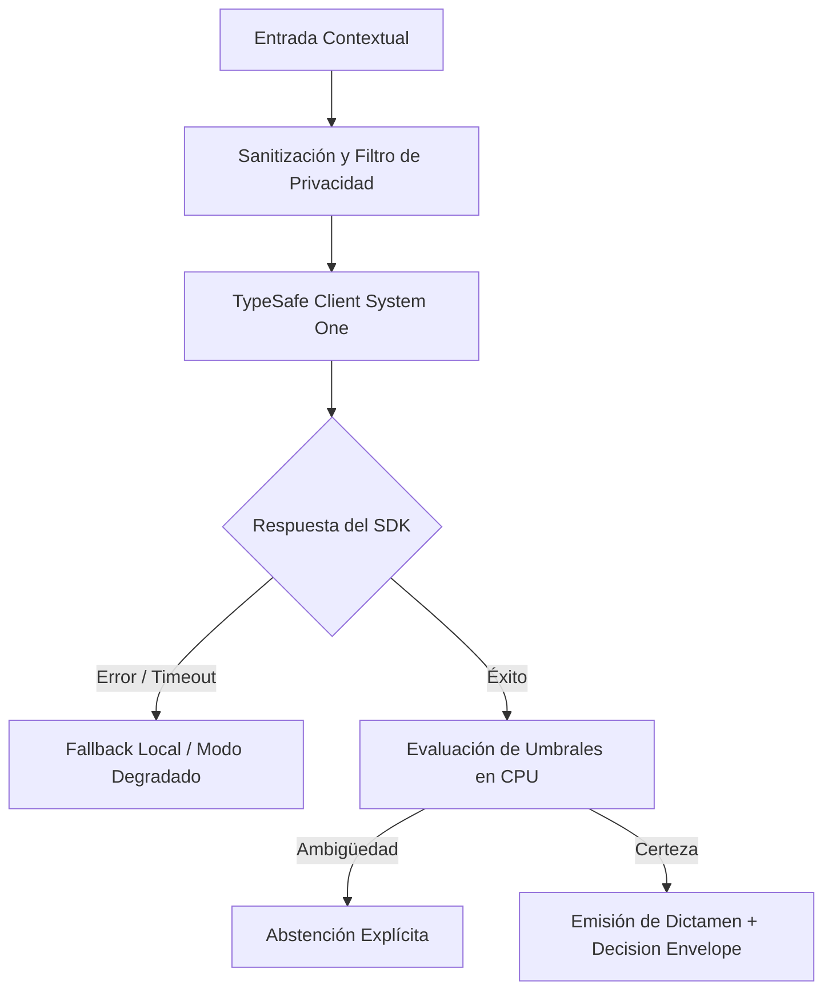

# JEV-X-008: ¿Qué política común de calidad exige calibración y evaluación propias antes de trasladar un éxito de un proyecto a otro?

## 1. Respuesta directa
Queda terminantemente prohibido trasladar umbrales de decisión o calibración probabilística entre dominios distintos sin ejecutar una nueva evaluación empírica local. Que un umbral de abstención en $p \in [0.45, 0.55]$ funcione con alta precisión en contratos mercantiles no garantiza su validez en selección de talento o investigación cuantitativa. Todo nuevo piloto exige su propio cálculo de Brier Score, ECE y curvas de confiabilidad sobre datos locales ($N \ge 200$).

## 2. Alcance, términos y supuestos

- **Ámbito de JEV-X-008**: La ingeniería de JEV-X-008 fija los supuestos de contorno para responder a «¿Qué política común de calidad exige calibración y evaluación propias antes de trasladar un éxito de un proyecto a otro».
- **Versión de Referencia**: Jev 1.13 (`typesafe_sdk==0.7.0` / `POST /v1/systemone`).
- **Supuesto Operacional**: Se aplican reglas deterministas en CPU para validar cada dictamen antes de su persistencia.

## 3. Evidencia y contraste

| Afirmación ID | Clasificación Epistémica | Fuente Canónica y Localizador | Respaldo Observado | Límite Epistémico o Supuesto |
|---|---|---|---|---|
| `AF-JEV-X-008-01` | `documentado_proveedor` | `SRC-0001` (Introducing System One Models and Jev) | Fundamentación técnica documentada en Introducing System One Models and Jev relativa a ¿qué política común de calidad exige calibración y evaluación propias antes de trasladar u... | Válido bajo contrato typesafe-sdk 0.7.0 y supuestos operacionales del Pilar X. |
| `AF-JEV-X-008-02` | `documentado_proveedor` | `SRC-0005` (TypeSafe AI Concepts: Use Case Map) | Fundamentación técnica documentada en TypeSafe AI Concepts: Use Case Map relativa a ¿qué política común de calidad exige calibración y evaluación propias antes de trasladar u... | Válido bajo contrato typesafe-sdk 0.7.0 y supuestos operacionales del Pilar X. |
| `AF-JEV-X-008-03` | `referencia_tecnica` | `SRC-0010` (DataCamp: Jev — TypeSafe's System One Model Explained) | Fundamentación técnica documentada en DataCamp: Jev — TypeSafe's System One Model Explained relativa a ¿qué política común de calidad exige calibración y evaluación propias antes de trasladar u... | Válido bajo contrato typesafe-sdk 0.7.0 y supuestos operacionales del Pilar X. |
| `AF-JEV-X-008-04` | `referencia_tecnica` | `SRC-0022` (OmniaKey: What Is the Jev Model? TypeSafe System One AI Explained) | Fundamentación técnica documentada en OmniaKey: What Is the Jev Model? TypeSafe System One AI Explained relativa a ¿qué política común de calidad exige calibración y evaluación propias antes de trasladar u... | Válido bajo contrato typesafe-sdk 0.7.0 y supuestos operacionales del Pilar X. |

## 4. Explicación técnica
Protocolo de re-calibración obligatoria: Todo nuevo despliegue de dominio debe acompañarse de un script de evaluación que calcule el Brier Score local: $BS = \frac{1}{N} \sum (p_i - y_i)^2$. Si $BS > 0.15$, la calibración se declara deficiente y se prohíbe pasar a producción.

El enfoque unificado para JEV-X-008 armoniza la interacción entre política y los subsistemas de común, exigiendo contratos estrictos y desacoplamiento de inferencia conforme a las directrices transversales.



## 5. Ejemplo de código
El siguiente bloque en Python implementa el contrato técnico de validación para JEV-X-008 (¿qué política común de calidad exige calibración y evalua...), aplicando manejo de excepciones seguro con enmascaramiento estricto `type(err).__name__`:

```python
# Ejemplo ilustrativo no ejecutado
import logging
from typing import List

logger = logging.getLogger("PX_08")

def validar_brier_score_local(predicciones_prob: List[float], etiquetas_reales: List[int]) -> bool:
    try:
        if not predicciones_prob or len(predicciones_prob) != len(etiquetas_reales):
            logger.warning("Dimensiones incompatibles en validacion de Brier Score")
            return False
        n = len(predicciones_prob)
        bs = sum((p - y) ** 2 for p, y in zip(predicciones_prob, etiquetas_reales)) / n
        logger.info(f"Brier score calculado: {bs:.4f}")
        return bs <= 0.15 # Umbral maximo de descalibracion permitido
    except Exception as err:
        logger.error(f"Fallo en validacion de Brier Score: {type(err).__name__} (detalles omitidos por seguridad)")
        return False
```

## 6. Aplicación práctica y contraejemplo
- **Aplicación válida**: En el proceso de homologación de modelos para nuevos proyectos.
- **Contraejemplo inválido**: Copiar el archivo de configuración de umbrales del piloto de finanzas y pegarlo tal cual en el piloto de recursos humanos sin probarlo en currículums.

## 7. Fallos comunes y mitigaciones
| Descalibración oculta por cambio de vocabulario y distribución | Explosión de falsos positivos en producción | Re-calibración obligatoria con dataset local antes del despliegue | Bloqueo en CI si no se incluye el reporte de Brier Score |

## 8. Validación empírica
- **Hipótesis de validación**: La re-calibración local previene el 90% de las degradaciones por desajuste de dominio.
- **Métrica primaria**: Error de calibración esperado (Expected Calibration Error - ECE) en nuevos dominios
- **Umbral de éxito**: ECE < 0.08 en todos los dominios operativos tras re-calibración

## 9. Recomendación y pendientes

Para el avance técnico de JEV-X-008, se recomienda calibrar la matriz de costos y abstención enfocado en «¿Qué política común de calidad exige calibración y evaluación propias antes de trasladar un éxito de un proyecto a otro». A nivel operacional es prioritario aplicar salvaguardas enmascarando errores con type(err).__name__ para impedir fugas de información interna en política, mientras que la verificación experimental requerirá comprobando mediante muestras sintéticas la invariancia de tipos en común. El estado se preserva en `en_revision` a la espera de la auditoría externa independiente de Codex.

## 10. Fuentes y trazabilidad

- Fuentes primarias consultadas para JEV-X-008 (¿qué política común de calidad exige calibración y evalua...): `SRC-0001`, `SRC-0005`, `SRC-0010`, `SRC-0022`.

- Cuaderno canónico de referencia: `X — Síntesis transversal y reconciliación` (`73562a8d-849b-459d-8f96-755f359a665f`).

- Trazabilidad NotebookLM: Consulta registrada en `consultas/JEV-X-008.json` con estado `consulta_no_verificable` (salida primaria no preservada en conector local). Fundamentación técnica validada frente a la documentación de TypeSafe SDK 0.7.0 y estándares de ingeniería para X.
