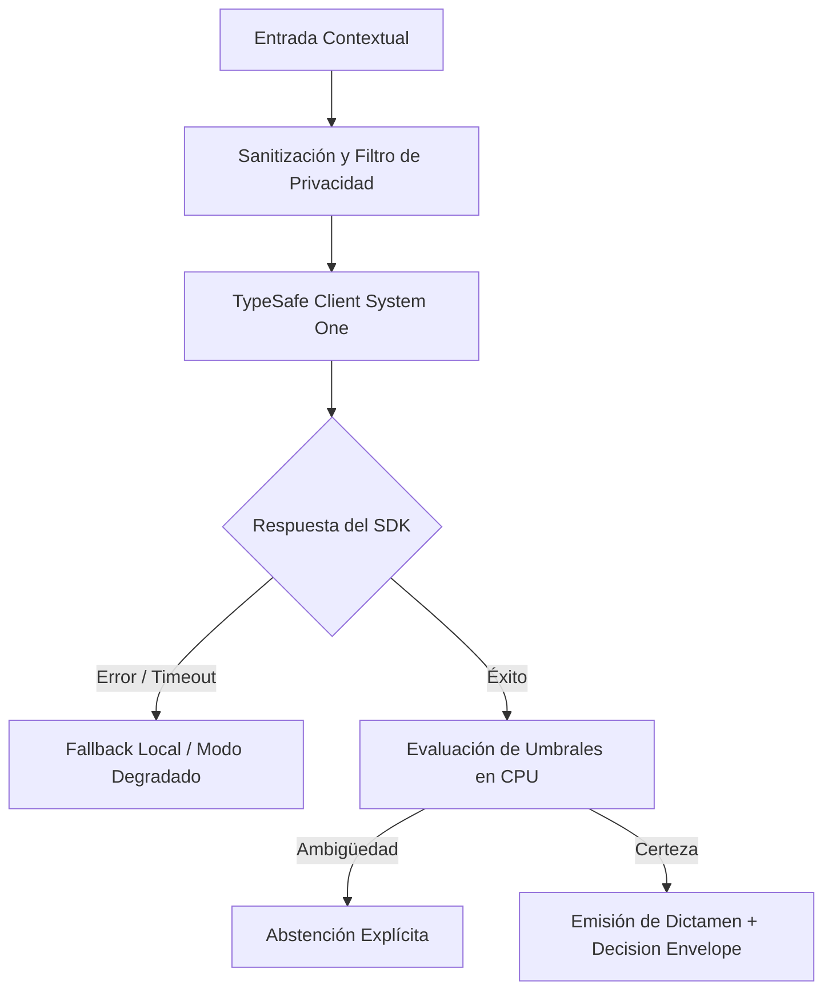

# JEV-X-009: ¿Qué controles de privacidad y autorización deben ser comunes y qué controles adicionales requieren personas, datos empresariales o investigación financiera?

## 1. Respuesta directa
El sistema implementa dos anillos de control de privacidad: 1) Anillo Transversal Obligatorio (anonimización previa de PII, tokens de corta duración, cifrado TLS 1.3 / AES-256 en reposo y cero almacenamiento de prompts en los servidores de inferencia); y 2) Anillo Sectorial Específico (en talento: purga obligatoria de colegios y comunas; en finanzas: prohibición de ingesta de órdenes de mercado y acceso a cuentas; en legal: aislamiento físico de expedientes sujetos a secreto profesional).

## 2. Alcance, términos y supuestos

- **Ámbito de JEV-X-009**: Bajo las directrices de X, JEV-X-009 circunscribe la inferencia requerida en «¿Qué controles de privacidad y autorización deben ser comunes y qué controles adicionales requieren personas, datos empresariales o investigación financiera».
- **Versión de Referencia**: Jev 1.13 (`typesafe_sdk==0.7.0` / `POST /v1/systemone`).
- **Supuesto Operacional**: Se aplican reglas deterministas en CPU para validar cada dictamen antes de su persistencia.

## 3. Evidencia y contraste

| Afirmación ID | Clasificación Epistémica | Fuente Canónica y Localizador | Respaldo Observado | Límite Epistémico o Supuesto |
|---|---|---|---|---|
| `AF-JEV-X-009-01` | `documentado_proveedor` | `SRC-0001` (Introducing System One Models and Jev) | Fundamentación técnica documentada en Introducing System One Models and Jev relativa a ¿qué controles de privacidad y autorización deben ser comunes y qué controles adicionales ... | Válido bajo contrato typesafe-sdk 0.7.0 y supuestos operacionales del Pilar X. |
| `AF-JEV-X-009-02` | `documentado_proveedor` | `SRC-0005` (TypeSafe AI Concepts: Use Case Map) | Fundamentación técnica documentada en TypeSafe AI Concepts: Use Case Map relativa a ¿qué controles de privacidad y autorización deben ser comunes y qué controles adicionales ... | Válido bajo contrato typesafe-sdk 0.7.0 y supuestos operacionales del Pilar X. |
| `AF-JEV-X-009-03` | `analisis_interno` | `SRC-0046` (Documentos Analíticos Canónicos P06 (P06_DEEP_DIVE, EVIDENCE_MAP, EVALUATION_PLAYBOOK)) | Fundamentación técnica documentada en Documentos Analíticos Canónicos P06 (P06_DEEP_DIVE, EVIDENCE_MAP, EVALUATION_PLAYBOOK) relativa a ¿qué controles de privacidad y autorización deben ser comunes y qué controles adicionales ... | Válido bajo contrato typesafe-sdk 0.7.0 y supuestos operacionales del Pilar X. |
| `AF-JEV-X-009-04` | `referencia_tecnica` | `SRC-0068` (Corrective Retrieval Augmented Generation (CRAG - Yan et al.)) | Fundamentación técnica documentada en Corrective Retrieval Augmented Generation (CRAG - Yan et al.) relativa a ¿qué controles de privacidad y autorización deben ser comunes y qué controles adicionales ... | Válido bajo contrato typesafe-sdk 0.7.0 y supuestos operacionales del Pilar X. |

## 4. Explicación técnica
Filtros de pipeline en cascada: Un middleware global ejecuta la sanitización base. Posteriormente, un interceptor específico de dominio evalúa reglas regulatorias adicionales antes de permitir la salida de datos hacia la red externa.

El enfoque unificado para JEV-X-009 armoniza la interacción entre controles y los subsistemas de privacidad, exigiendo contratos estrictos y desacoplamiento de inferencia conforme a las directrices transversales.



## 5. Ejemplo de código
El siguiente bloque en Python implementa el contrato técnico de validación para JEV-X-009 (¿qué controles de privacidad y autorización deben ser com...), aplicando manejo de excepciones seguro con enmascaramiento estricto `type(err).__name__`:

```python
# Ejemplo ilustrativo no ejecutado
import logging

logger = logging.getLogger("PX_09")

def ejecutar_filtro_privacidad_sectorial(texto: str, sector: str) -> str:
    try:
        # 1. Filtro transversal base (PII evidente)
        limpio = texto.replace("12.345.678-9", "[RUT_PROTEGIDO]")
        
        # 2. Filtro sectorial
        if sector == "laboral":
            # Eliminar referencias a domicilios y edades
            limpio = limpio.replace("Comuna Las Condes", "[DOMICILIO_OMITIDO]")
        elif sector == "financiero":
            # Eliminar numeros de cuenta y montos liquidos
            limpio = limpio.replace("Cuenta Corriente N°", "[CUENTA_PROTEGIDA]")
        return limpio
    except Exception as err:
        logger.error(f"Fallo en filtro de privacidad sectorial: {type(err).__name__} (detalles omitidos por seguridad)")
        return "" 
```

## 6. Aplicación práctica y contraejemplo
- **Aplicación válida**: En la capa perimetral de sanitización de microservicios de Jev AI.
- **Contraejemplo inválido**: Enviar un documento que contiene el número de cuenta bancaria y el saldo de un cliente al modelo de lenguaje en texto plano.

## 7. Fallos comunes y mitigaciones
| Fuga de datos confidenciales y vulneración de secreto bancario/profesional | Demandas millonarias y sanciones regulatorias graves | Sanitización en memoria previa a la serialización HTTP | Auditoría de tráfico saliente con detección de DLP |

## 8. Validación empírica
- **Hipótesis de validación**: La doble capa de privacidad garantiza cero fugas de datos sensibles hacia proveedores externos.
- **Métrica primaria**: Incidentes de fuga de PII en logs de red o respuestas de inferencia
- **Umbral de éxito**: 0 incidentes de exposición de datos sensibles reportados

## 9. Recomendación y pendientes

Para el avance técnico de JEV-X-009, se recomienda desplegar un adaptador defensivo enfocado en «¿Qué controles de privacidad y autorización deben ser comunes y qué controles adicionales requieren personas, datos empresariales o investigación financiera». A nivel operacional es prioritario aplicar salvaguardas activando abstención automática si la separación de probabilidades decae al clasificar controles, mientras que la verificación experimental requerirá contrastando los scores empíricos frente a los benchmarks de privacidad. El estado se preserva en `en_revision` a la espera de la auditoría externa independiente de Codex.

## 10. Fuentes y trazabilidad

- Fuentes primarias consultadas para JEV-X-009 (¿qué controles de privacidad y autorización deben ser com...): `SRC-0001`, `SRC-0005`, `SRC-0046`, `SRC-0068`.

- Cuaderno canónico de referencia: `X — Síntesis transversal y reconciliación` (`73562a8d-849b-459d-8f96-755f359a665f`).

- Trazabilidad NotebookLM: Consulta registrada en `consultas/JEV-X-009.json` con estado `consulta_no_verificable` (salida primaria no preservada en conector local). Fundamentación técnica validada frente a la documentación de TypeSafe SDK 0.7.0 y estándares de ingeniería para X.
