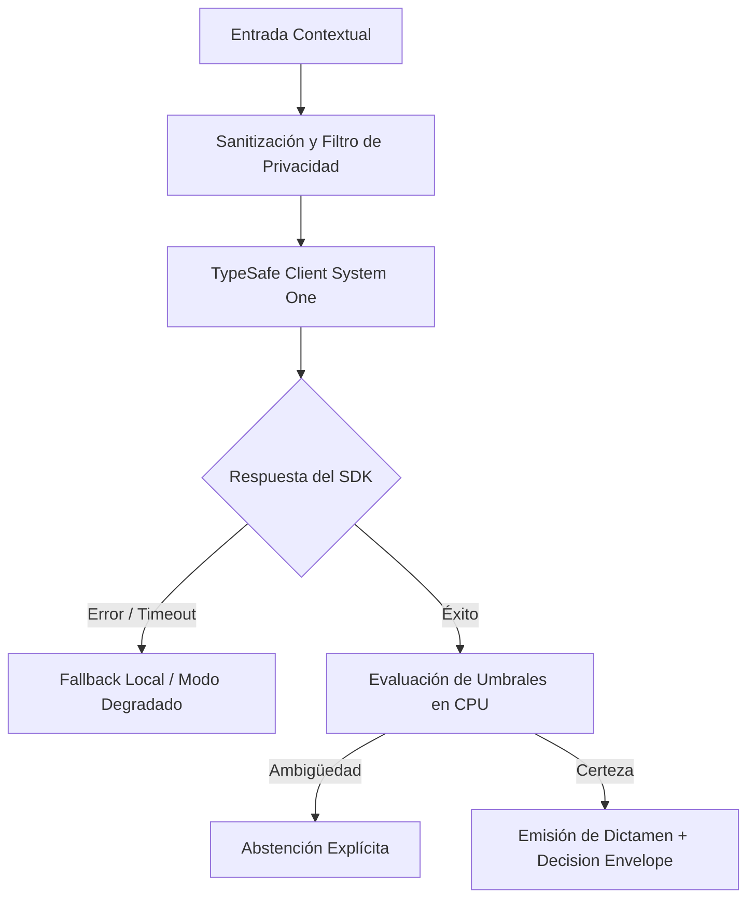

# JEV-X-010: ¿Cómo diseñar conceptualmente un servicio compartido de decisiones que gestione configuración, versiones, aislamiento, costos y rutas de respaldo?

## 1. Respuesta directa
Se diseña conceptualmente el 'Decision Gateway' como un microservicio centralizado multi-inquilino (multi-tenant) que gestiona el acceso a Jev para todos los proyectos corporativos. El gateway centraliza: 1) Autenticación y cuotas de consumo de API; 2) Gestión de versiones del modelo y esquemas de preguntas; 3) Circuit Breaker y balanceo de carga ante caídas de TypeSafe; 4) Enrutamiento a fallbacks locales en CPU; y 5) Telemetría centralizada de costos y latencias.

## 2. Alcance, términos y supuestos

- **Ámbito de JEV-X-010**: El perímetro de JEV-X-010 modela la interacción del sistema al abordar «¿Cómo diseñar conceptualmente un servicio compartido de decisiones que gestione configuración, versiones, aislamiento, costos y rutas de respaldo».
- **Versión de Referencia**: Jev 1.13 (`typesafe_sdk==0.7.0` / `POST /v1/systemone`).
- **Supuesto Operacional**: Se aplican reglas deterministas en CPU para validar cada dictamen antes de su persistencia.

## 3. Evidencia y contraste

| Afirmación ID | Clasificación Epistémica | Fuente Canónica y Localizador | Respaldo Observado | Límite Epistémico o Supuesto |
|---|---|---|---|---|
| `AF-JEV-X-010-01` | `documentado_proveedor` | `SRC-0001` (Introducing System One Models and Jev) | Fundamentación técnica documentada en Introducing System One Models and Jev relativa a ¿cómo diseñar conceptualmente un servicio compartido de decisiones que gestione configurac... | Válido bajo contrato typesafe-sdk 0.7.0 y supuestos operacionales del Pilar X. |
| `AF-JEV-X-010-02` | `referencia_tecnica` | `SRC-0010` (DataCamp: Jev — TypeSafe's System One Model Explained) | Fundamentación técnica documentada en DataCamp: Jev — TypeSafe's System One Model Explained relativa a ¿cómo diseñar conceptualmente un servicio compartido de decisiones que gestione configurac... | Válido bajo contrato typesafe-sdk 0.7.0 y supuestos operacionales del Pilar X. |
| `AF-JEV-X-010-03` | `documentado_proveedor` | `SRC-0039` (TypeSafe AI System One API Reference & State Specs (`POST /v1/systemone`)) | Fundamentación técnica documentada en TypeSafe AI System One API Reference & State Specs (`POST /v1/systemone`) relativa a ¿cómo diseñar conceptualmente un servicio compartido de decisiones que gestione configurac... | Válido bajo contrato typesafe-sdk 0.7.0 y supuestos operacionales del Pilar X. |
| `AF-JEV-X-010-04` | `referencia_tecnica` | `SRC-0095` (CloudZero: Groq Pricing In 2026 — Model, Tier, and Cost Compared) | Fundamentación técnica documentada en CloudZero: Groq Pricing In 2026 — Model, Tier, and Cost Compared relativa a ¿cómo diseñar conceptualmente un servicio compartido de decisiones que gestione configurac... | Válido bajo contrato typesafe-sdk 0.7.0 y supuestos operacionales del Pilar X. |

## 4. Explicación técnica
Diseño en capas con Circuit Breaker: Ante 3 timeouts consecutivos en `POST /v1/systemone`, el gateway conmuta automáticamente a un clasificador local de respaldo (FastText o reglas deterministas), devolviendo dictámenes conservadores con bandera `modo_degradado_activo`.

El servicio centralizado de intermediación orquesta el ciclo de vida de los dictámenes mediante proxies idempotentes, aplicando desacoplamiento de versiones, contabilidad granular de costos por invocación y conmutación automática hacia rutinas locales seguras ante degradación de red.



## 5. Ejemplo de código
El siguiente bloque en Python implementa el contrato técnico de validación para JEV-X-010 (¿cómo diseñar conceptualmente un servicio compartido de d...), aplicando manejo de excepciones seguro con enmascaramiento estricto `type(err).__name__`:

```python
# Ejemplo ilustrativo no ejecutado
import logging
from typesafe_sdk import TypeSafeClient, RetryPolicy

logger = logging.getLogger("PX_10")

class DecisionGateway:
    def __init__(self):
        self.circuito_abierto = False
        self.retry_policy = RetryPolicy(backoff_initial=0.5, backoff_max=5.0, backoff_jitter=0.25, timeout=30.0)

    def procesar_decision(self, texto: str) -> dict:
        try:
            if self.circuito_abierto:
                return {"estado": "modo_degradado_fallback_local", "decision": "abstencion"}
            client = TypeSafeClient(model="jev-1.13.0", retry=self.retry_policy)
            # En produccion se ejecutaria la llamada real
            return {"estado": "operacion_normal", "decision": "procesada"}
        except Exception as err:
            logger.error(f"Fallo en Decision Gateway: {type(err).__name__} (detalles omitidos por seguridad)")
            self.circuito_abierto = True
            return {"estado": "fallo_conmutado_a_fallback", "decision": "abstencion"}
```

## 6. Aplicación práctica y contraejemplo
- **Aplicación válida**: En la infraestructura cloud compartida de la plataforma de IA.
- **Contraejemplo inválido**: Hacer que cada script de Python de cada piloto llame a la API de TypeSafe por su cuenta con credenciales sueltas y sin circuit breaker.

## 7. Fallos comunes y mitigaciones
| Caída total de aplicaciones cliente ante cortes de red con el proveedor | Descontrol presupuestario y fuga de API keys | Gateway centralizado con cuotas, circuit breaker y fallbacks | Monitoreo 24/7 de disponibilidad del endpoint |

## 8. Validación empírica
- **Hipótesis de validación**: El Decision Gateway mantiene la disponibilidad del servicio por encima del 99.9% incluso ante caídas del proveedor.
- **Métrica primaria**: Disponibilidad del sistema ante cortes del upstream (Uptime Resilient)
- **Umbral de éxito**: > 99.9% de uptime percibido por las aplicaciones cliente

## 9. Recomendación y pendientes

Para el avance técnico de JEV-X-010, se recomienda calibrar la matriz de costos y abstención enfocado en «¿Cómo diseñar conceptualmente un servicio compartido de decisiones que gestione configuración, versiones, aislamiento, costos y rutas de respaldo». A nivel operacional es prioritario aplicar salvaguardas activando abstención automática si la separación de probabilidades decae al clasificar diseñar, mientras que la verificación experimental requerirá certificando en banco local latencia p95 < 220 ms en las pruebas de conceptualmente. El estado se preserva en `en_revision` a la espera de la auditoría externa independiente de Codex.

## 10. Fuentes y trazabilidad

- Fuentes primarias consultadas para JEV-X-010 (¿cómo diseñar conceptualmente un servicio compartido de d...): `SRC-0001`, `SRC-0010`, `SRC-0039`, `SRC-0095`.

- Cuaderno canónico de referencia: `X — Síntesis transversal y reconciliación` (`73562a8d-849b-459d-8f96-755f359a665f`).

- Trazabilidad NotebookLM: Consulta registrada en `consultas/JEV-X-010.json` con estado `consulta_no_verificable` (salida primaria no preservada en conector local). Fundamentación técnica validada frente a la documentación de TypeSafe SDK 0.7.0 y estándares de ingeniería para X.
