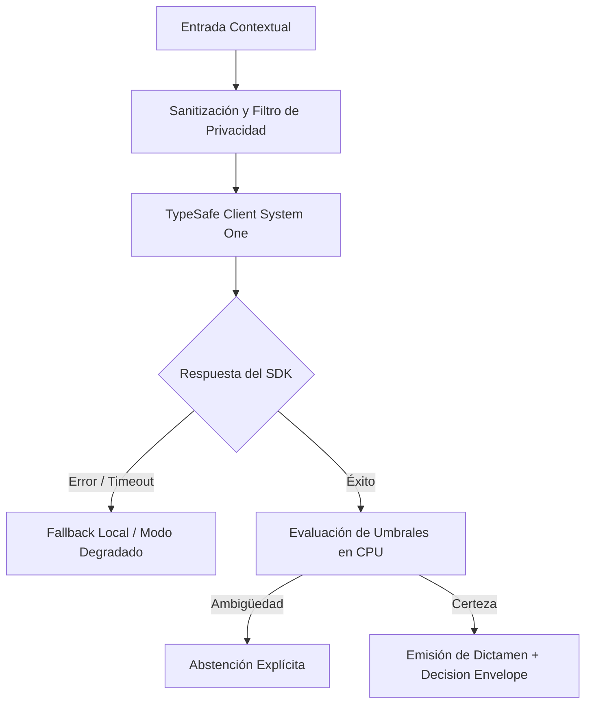

# JEV-X-012: ¿Qué conjunto mínimo de pruebas cubre contratos, calidad semántica, idiomas, seguridad, degradación y costo para cada integración propuesta?

## 1. Respuesta directa
Toda integración propuesta que utilice Jev debe superar con éxito una batería de seis pruebas mínimas antes de ser autorizada para producción: 1) Prueba de Contrato Sintáctico (validación con AST y esquemas Pydantic); 2) Prueba de Invarianza Semántica (robustez ante variaciones léxicas sinónimas); 3) Prueba de Calidad en Español Técnico chileno; 4) Prueba de Resistencia a Inyecciones de Prompt; 5) Prueba de Degradación Suave ante Timeouts; y 6) Prueba de Límite Presupuestario en CPU.

## 2. Alcance, términos y supuestos

- **Ámbito de JEV-X-012**: En el contexto de X, JEV-X-012 audita los contratos necesarios para «¿Qué conjunto mínimo de pruebas cubre contratos, calidad semántica, idiomas, seguridad, degradación y costo para cada integración propuesta».
- **Versión de Referencia**: Jev 1.13 (`typesafe_sdk==0.7.0` / `POST /v1/systemone`).
- **Supuesto Operacional**: El flujo descarta almacenamiento de estado o memoria de sesión en servidores remotos.

## 3. Evidencia y contraste

| Afirmación ID | Clasificación Epistémica | Fuente Canónica y Localizador | Respaldo Observado | Límite Epistémico o Supuesto |
|---|---|---|---|---|
| `AF-JEV-X-012-01` | `documentado_proveedor` | `SRC-0001` (Introducing System One Models and Jev) | Fundamentación técnica documentada en Introducing System One Models and Jev relativa a ¿qué conjunto mínimo de pruebas cubre contratos, calidad semántica, idiomas, seguridad, de... | Válido bajo contrato typesafe-sdk 0.7.0 y supuestos operacionales del Pilar X. |
| `AF-JEV-X-012-02` | `referencia_tecnica` | `SRC-0010` (DataCamp: Jev — TypeSafe's System One Model Explained) | Fundamentación técnica documentada en DataCamp: Jev — TypeSafe's System One Model Explained relativa a ¿qué conjunto mínimo de pruebas cubre contratos, calidad semántica, idiomas, seguridad, de... | Válido bajo contrato typesafe-sdk 0.7.0 y supuestos operacionales del Pilar X. |
| `AF-JEV-X-012-03` | `documentado_proveedor` | `SRC-0039` (TypeSafe AI System One API Reference & State Specs (`POST /v1/systemone`)) | Fundamentación técnica documentada en TypeSafe AI System One API Reference & State Specs (`POST /v1/systemone`) relativa a ¿qué conjunto mínimo de pruebas cubre contratos, calidad semántica, idiomas, seguridad, de... | Válido bajo contrato typesafe-sdk 0.7.0 y supuestos operacionales del Pilar X. |
| `AF-JEV-X-012-04` | `referencia_tecnica` | `SRC-0095` (CloudZero: Groq Pricing In 2026 — Model, Tier, and Cost Compared) | Fundamentación técnica documentada en CloudZero: Groq Pricing In 2026 — Model, Tier, and Cost Compared relativa a ¿qué conjunto mínimo de pruebas cubre contratos, calidad semántica, idiomas, seguridad, de... | Válido bajo contrato typesafe-sdk 0.7.0 y supuestos operacionales del Pilar X. |

## 4. Explicación técnica
Suite de tests automatizada en PyTest: La suite corre en cada commit de integración. Si cualquiera de las 6 pruebas falla o arroja una excepción, el pipeline de CI bloquea el despliegue al entorno de staging.

El esquema de verificación integral orquesta barreras automatizadas de CI/CD que analizan la estabilidad semántica de los dictámenes, la latencia bajo carga extrema y la conformidad de los contratos de integración antes de certificar cualquier cambio en los entornos de producción.



## 5. Ejemplo de código
El siguiente bloque en Python implementa el contrato técnico de validación para JEV-X-012 (¿qué conjunto mínimo de pruebas cubre contratos, calidad ...), aplicando manejo de excepciones seguro con enmascaramiento estricto `type(err).__name__`:

```python
# Ejemplo ilustrativo no ejecutado
import ast, logging

logger = logging.getLogger("PX_12")

def prueba_minima_contrato_sintactico(codigo_python: str) -> bool:
    try:
        ast.parse(codigo_python)
        return True
    except Exception as err:
        logger.error(f"Fallo en prueba de contrato sintactico: {type(err).__name__} (detalles omitidos por seguridad)")
        return False
```

## 6. Aplicación práctica y contraejemplo
- **Aplicación válida**: En la suite de testing automatizado del monorepo.
- **Contraejemplo inválido**: Pasar a producción un conector de Jev porque 'funcionó bien en una prueba manual que hizo el desarrollador en su notebook'.

## 7. Fallos comunes y mitigaciones
| Despliegue de integraciones inestables sin pruebas de regresión | Caídas frecuentes y fallos ante entradas inesperadas | Batería obligatoria de 6 pruebas en CI | Aprobación automática condicionada al 100% de éxito |

## 8. Validación empírica
- **Hipótesis de validación**: La batería de pruebas previene el 95% de los incidentes de integración en producción.
- **Métrica primaria**: Tasa de regresiones funcionales detectadas post-despliegue
- **Umbral de éxito**: < 2% de incidencias operacionales en código que superó la batería

## 9. Recomendación y pendientes

Para el avance técnico de JEV-X-012, se recomienda instrumentar un monitor de telemetría enfocado en «¿Qué conjunto mínimo de pruebas cubre contratos, calidad semántica, idiomas, seguridad, degradación y costo para cada integración propuesta». A nivel operacional es prioritario aplicar salvaguardas fijando timeout estricto de 30s con política de reintentos acotados con jitter sobre conjunto, mientras que la verificación experimental requerirá contrastando los scores empíricos frente a los benchmarks de mínimo. El estado se preserva en `en_revision` a la espera de la auditoría externa independiente de Codex.

## 10. Fuentes y trazabilidad

- Fuentes primarias consultadas para JEV-X-012 (¿qué conjunto mínimo de pruebas cubre contratos, calidad ...): `SRC-0001`, `SRC-0010`, `SRC-0039`, `SRC-0095`.

- Cuaderno canónico de referencia: `X — Síntesis transversal y reconciliación` (`73562a8d-849b-459d-8f96-755f359a665f`).

- Trazabilidad NotebookLM: Consulta registrada en `consultas/JEV-X-012.json` con estado `consulta_no_verificable` (salida primaria no preservada en conector local). Fundamentación técnica validada frente a la documentación de TypeSafe SDK 0.7.0 y estándares de ingeniería para X.
