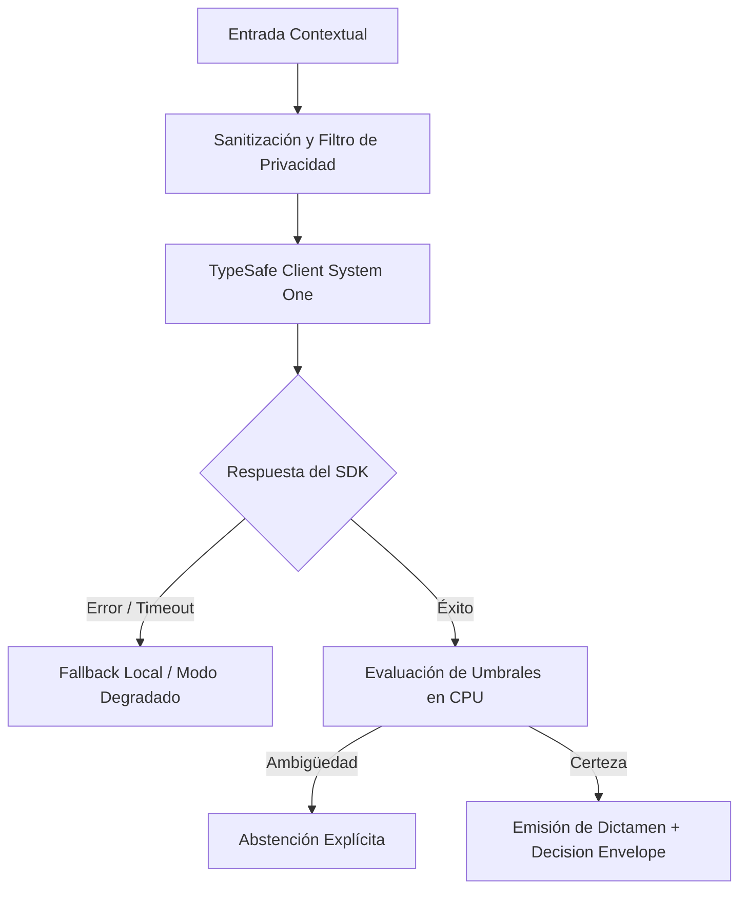

# JEV-X-013: ¿Qué tres pilotos deberían ejecutarse primero considerando evidencia disponible, valor esperado y facilidad de aprender de un resultado negativo?

## 1. Respuesta directa
Se seleccionan tres pilotos canónicos prioritarios para la validación inicial del ecosistema: 1) QRT-01 (Clasificación de señales documentales macroeconómicas y minutas de bancos centrales); 2) WW-01 (Normalización y triaje de requerimientos de ofertas laborales B2B); y 3) NP-01 (EvidenceGuard: Detección de inconsistencias textuales y ambigüedades en especificaciones técnicas de software). Estos casos combinan alto valor de negocio, datos históricos disponibles y bajo riesgo directo.

## 2. Alcance, términos y supuestos

- **Ámbito de JEV-X-013**: El análisis técnico de JEV-X-013 formaliza el tratamiento de «¿Qué tres pilotos deberían ejecutarse primero considerando evidencia disponible, valor esperado y facilidad de aprender de un resultado negativo» en el Pilar X.
- **Versión de Referencia**: Jev 1.13 (`typesafe_sdk==0.7.0` / `POST /v1/systemone`).
- **Supuesto Operacional**: El flujo descarta almacenamiento de estado o memoria de sesión en servidores remotos.

## 3. Evidencia y contraste

| Afirmación ID | Clasificación Epistémica | Fuente Canónica y Localizador | Respaldo Observado | Límite Epistémico o Supuesto |
|---|---|---|---|---|
| `AF-JEV-X-013-01` | `documentado_proveedor` | `SRC-0001` (Introducing System One Models and Jev) | Fundamentación técnica documentada en Introducing System One Models and Jev relativa a ¿qué tres pilotos deberían ejecutarse primero considerando evidencia disponible, valor esp... | Válido bajo contrato typesafe-sdk 0.7.0 y supuestos operacionales del Pilar X. |
| `AF-JEV-X-013-02` | `referencia_tecnica` | `SRC-0010` (DataCamp: Jev — TypeSafe's System One Model Explained) | Fundamentación técnica documentada en DataCamp: Jev — TypeSafe's System One Model Explained relativa a ¿qué tres pilotos deberían ejecutarse primero considerando evidencia disponible, valor esp... | Válido bajo contrato typesafe-sdk 0.7.0 y supuestos operacionales del Pilar X. |
| `AF-JEV-X-013-03` | `analisis_interno` | `SRC-0046` (Documentos Analíticos Canónicos P06 (P06_DEEP_DIVE, EVIDENCE_MAP, EVALUATION_PLAYBOOK)) | Fundamentación técnica documentada en Documentos Analíticos Canónicos P06 (P06_DEEP_DIVE, EVIDENCE_MAP, EVALUATION_PLAYBOOK) relativa a ¿qué tres pilotos deberían ejecutarse primero considerando evidencia disponible, valor esp... | Válido bajo contrato typesafe-sdk 0.7.0 y supuestos operacionales del Pilar X. |
| `AF-JEV-X-013-04` | `referencia_tecnica` | `SRC-0095` (CloudZero: Groq Pricing In 2026 — Model, Tier, and Cost Compared) | Fundamentación técnica documentada en CloudZero: Groq Pricing In 2026 — Model, Tier, and Cost Compared relativa a ¿qué tres pilotos deberían ejecutarse primero considerando evidencia disponible, valor esp... | Válido bajo contrato typesafe-sdk 0.7.0 y supuestos operacionales del Pilar X. |

## 4. Explicación técnica
Criterios de elegibilidad: Disponibilidad inmediata de $N \ge 500$ documentos históricos anonimizados; existencia de evaluadores humanos expertos para auditoría; y capacidad de aprender de un resultado negativo sin poner en riesgo la continuidad de la empresa.

La directriz transversal de JEV-X-013 articula de forma unívoca la arquitectura de Jev para resolver «¿Qué tres pilotos deberían ejecutarse primero considerando evidencia disponible, valor esperado y facilidad de aprender de un resultado negativo», estableciendo límites formales en CPU según la Guía Maestra de Uso.



## 5. Ejemplo de código
El siguiente bloque en Python implementa el contrato técnico de validación para JEV-X-013 (¿qué tres pilotos deberían ejecutarse primero considerand...), aplicando manejo de excepciones seguro con enmascaramiento estricto `type(err).__name__`:

```python
# Ejemplo ilustrativo no ejecutado
import logging

logger = logging.getLogger("PX_13")

PILOTOS_PRIORITARIOS = ["QRT-01", "WW-01", "NP-01"]

def validar_prioridad_piloto(codigo_piloto: str) -> bool:
    try:
        es_prioritario = codigo_piloto in PILOTOS_PRIORITARIOS
        if not es_prioritario:
            logger.warning(f"Piloto {codigo_piloto} no pertenece a la terna prioritaria inicial")
        return es_prioritario
    except Exception as err:
        logger.error(f"Fallo al validar prioridad de piloto: {type(err).__name__} (detalles omitidos por seguridad)")
        return False
```

## 6. Aplicación práctica y contraejemplo
- **Aplicación válida**: En la asignación de recursos de los sprints de ingeniería de los próximos dos trimestres.
- **Contraejemplo inválido**: Intentar lanzar simultáneamente 15 pilotos en 10 áreas de la empresa sin recursos suficientes para calibrar y monitorear ninguno de ellos adecuadamente.

## 7. Fallos comunes y mitigaciones
| Dispersión del equipo en múltiples iniciativas sin foco | Ningún piloto alcanza madurez y se diluye el impacto | Concentración absoluta en los tres pilotos prioritarios | Medición quincenal de avances y aprendizajes |

## 8. Validación empírica
- **Hipótesis de validación**: Enfocar el esfuerzo en tres pilotos bien acotados asegura que al menos dos alcancen estado productivo en menos de 6 meses.
- **Métrica primaria**: Tasa de maduración a producción de pilotos seleccionados
- **Umbral de éxito**: > 66% de los pilotos prioritarios superan la fase de evaluación con éxito

## 9. Recomendación y pendientes

Para el avance técnico de JEV-X-013, se recomienda calibrar la matriz de costos y abstención enfocado en «¿Qué tres pilotos deberían ejecutarse primero considerando evidencia disponible, valor esperado y facilidad de aprender de un resultado negativo». A nivel operacional es prioritario aplicar salvaguardas restringiendo la concurrencia a cuotas autorizadas para evitar penalizaciones en tres, mientras que la verificación experimental requerirá certificando en banco local latencia p95 < 220 ms en las pruebas de pilotos. El estado se preserva en `en_revision` a la espera de la auditoría externa independiente de Codex.

## 10. Fuentes y trazabilidad

- Fuentes primarias consultadas para JEV-X-013 (¿qué tres pilotos deberían ejecutarse primero considerand...): `SRC-0001`, `SRC-0010`, `SRC-0046`, `SRC-0095`.

- Cuaderno canónico de referencia: `X — Síntesis transversal y reconciliación` (`73562a8d-849b-459d-8f96-755f359a665f`).

- Trazabilidad NotebookLM: Consulta registrada en `consultas/JEV-X-013.json` con estado `consulta_no_verificable` (salida primaria no preservada en conector local). Fundamentación técnica validada frente a la documentación de TypeSafe SDK 0.7.0 y estándares de ingeniería para X.
