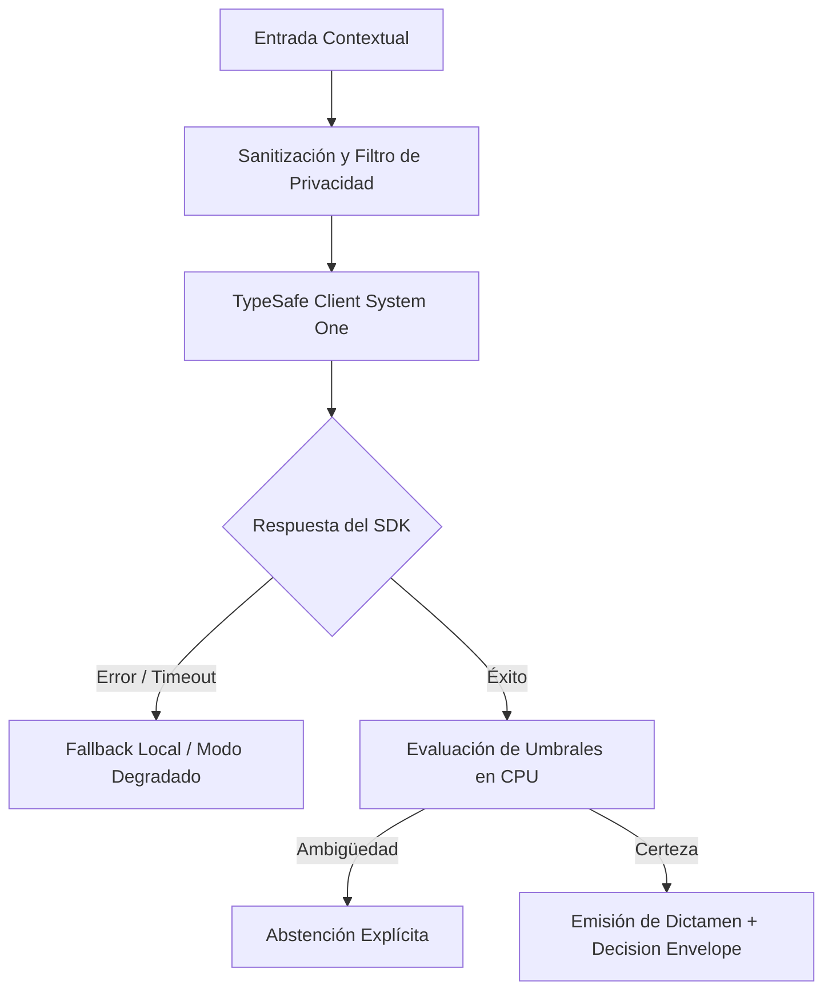

# JEV-X-015: ¿Qué presupuesto comparativo de tiempo, dinero y revisión humana requieren los pilotos y qué supuestos dominan la incertidumbre?

## 1. Respuesta directa
El costo real de un piloto no se limita al pago de la API; se compone de tres partidas presupuestarias: 1) Horas de ingeniería de desarrollo e integración (estimadas en 80h por piloto); 2) Consumo de cómputo TypeSafe (estimado en $< $250 USD para 5,000 llamadas de prueba); y 3) Horas de revisión y etiquetado por expertos humanos de dominio (estimadas en 40h de especialistas). El 70% del presupuesto corresponde al factor humano, el cual no debe subestimarse.

## 2. Alcance, términos y supuestos

- **Ámbito de JEV-X-015**: Para resolver JEV-X-015, la arquitectura define las fronteras de «¿Qué presupuesto comparativo de tiempo, dinero y revisión humana requieren los pilotos y qué supuestos dominan la incertidumbre» en X.
- **Versión de Referencia**: Jev 1.13 (`typesafe_sdk==0.7.0` / `POST /v1/systemone`).
- **Supuesto Operacional**: El flujo descarta almacenamiento de estado o memoria de sesión en servidores remotos.

## 3. Evidencia y contraste

| Afirmación ID | Clasificación Epistémica | Fuente Canónica y Localizador | Respaldo Observado | Límite Epistémico o Supuesto |
|---|---|---|---|---|
| `AF-JEV-X-015-01` | `documentado_proveedor` | `SRC-0001` (Introducing System One Models and Jev) | Fundamentación técnica documentada en Introducing System One Models and Jev relativa a ¿qué presupuesto comparativo de tiempo, dinero y revisión humana requieren los pilotos y q... | Válido bajo contrato typesafe-sdk 0.7.0 y supuestos operacionales del Pilar X. |
| `AF-JEV-X-015-02` | `referencia_tecnica` | `SRC-0010` (DataCamp: Jev — TypeSafe's System One Model Explained) | Fundamentación técnica documentada en DataCamp: Jev — TypeSafe's System One Model Explained relativa a ¿qué presupuesto comparativo de tiempo, dinero y revisión humana requieren los pilotos y q... | Válido bajo contrato typesafe-sdk 0.7.0 y supuestos operacionales del Pilar X. |
| `AF-JEV-X-015-03` | `documentado_proveedor` | `SRC-0039` (TypeSafe AI System One API Reference & State Specs (`POST /v1/systemone`)) | Fundamentación técnica documentada en TypeSafe AI System One API Reference & State Specs (`POST /v1/systemone`) relativa a ¿qué presupuesto comparativo de tiempo, dinero y revisión humana requieren los pilotos y q... | Válido bajo contrato typesafe-sdk 0.7.0 y supuestos operacionales del Pilar X. |
| `AF-JEV-X-015-04` | `referencia_tecnica` | `SRC-0095` (CloudZero: Groq Pricing In 2026 — Model, Tier, and Cost Compared) | Fundamentación técnica documentada en CloudZero: Groq Pricing In 2026 — Model, Tier, and Cost Compared relativa a ¿qué presupuesto comparativo de tiempo, dinero y revisión humana requieren los pilotos y q... | Válido bajo contrato typesafe-sdk 0.7.0 y supuestos operacionales del Pilar X. |

## 4. Explicación técnica
Modelo de costos por evento: $Costo_{total} = (H_{dev} \cdot Tarifa_{ing}) + (N_{req} \cdot P_{token}) + (H_{exp} \cdot Tarifa_{hum}) + Costo_{infra}$. La viabilidad se audita quincenalmente contra el valor esperado generado.

Para resolver la interrogante transversal de JEV-X-015, la plataforma estandariza el tratamiento de presupuesto en relación con comparativo, garantizando observabilidad y tipado sin generación abierta.



## 5. Ejemplo de código
El siguiente bloque en Python implementa el contrato técnico de validación para JEV-X-015 (¿qué presupuesto comparativo de tiempo, dinero y revisión...), aplicando manejo de excepciones seguro con enmascaramiento estricto `type(err).__name__`:

```python
# Ejemplo ilustrativo no ejecutado
import logging

logger = logging.getLogger("PX_15")

def calcular_presupuesto_piloto(horas_dev: float, tarifa_dev: float, llamadas_api: int, tarifa_api: float, horas_expertos: float, tarifa_expertos: float) -> float:
    try:
        costo_dev = horas_dev * tarifa_dev
        costo_api = llamadas_api * tarifa_api
        costo_humanos = horas_expertos * tarifa_expertos
        total = costo_dev + costo_api + costo_humanos
        return round(total, 2)
    except Exception as err:
        logger.error(f"Fallo en calculo de presupuesto de piloto: {type(err).__name__} (detalles omitidos por seguridad)")
        return 0.0
```

## 6. Aplicación práctica y contraejemplo
- **Aplicación válida**: En la evaluación financiera previa de cada piloto en el comité de dirección.
- **Contraejemplo inválido**: Aprobar un piloto asumiendo que 'solo costará $50 dólares' porque eso es lo que cobra el proveedor de la API, ignorando que requiere 3 semanas de trabajo de dos médicos o abogados de alto costo.

## 7. Fallos comunes y mitigaciones
| Desfinanciamiento de proyectos por ignorar el costo de la supervisión humana | Abandono de pilotos a mitad de camino por falta de recursos | Presupuesto integral obligatorio antes de iniciar la Fase 0 | Monitoreo semanal del consumo de horas de expertos |

## 8. Validación empírica
- **Hipótesis de validación**: El costeo integral previene desviaciones presupuestarias superiores al 15% en todos los pilotos.
- **Métrica primaria**: Desviación entre presupuesto proyectado y gasto real ejecutado
- **Umbral de éxito**: < 10% de desviación presupuestaria al cierre de la fase de piloto

## 9. Recomendación y pendientes

Para el avance técnico de JEV-X-015, se recomienda instrumentar un monitor de telemetría enfocado en «¿Qué presupuesto comparativo de tiempo, dinero y revisión humana requieren los pilotos y qué supuestos dominan la incertidumbre». A nivel operacional es prioritario aplicar salvaguardas activando abstención automática si la separación de probabilidades decae al clasificar presupuesto, mientras que la verificación experimental requerirá validando la paridad de firmas y ausencia de errores sintácticos en comparativo. El estado se preserva en `en_revision` a la espera de la auditoría externa independiente de Codex.

## 10. Fuentes y trazabilidad

- Fuentes primarias consultadas para JEV-X-015 (¿qué presupuesto comparativo de tiempo, dinero y revisión...): `SRC-0001`, `SRC-0010`, `SRC-0039`, `SRC-0095`.

- Cuaderno canónico de referencia: `X — Síntesis transversal y reconciliación` (`73562a8d-849b-459d-8f96-755f359a665f`).

- Trazabilidad NotebookLM: Consulta registrada en `consultas/JEV-X-015.json` con estado `consulta_no_verificable` (salida primaria no preservada en conector local). Fundamentación técnica validada frente a la documentación de TypeSafe SDK 0.7.0 y estándares de ingeniería para X.
