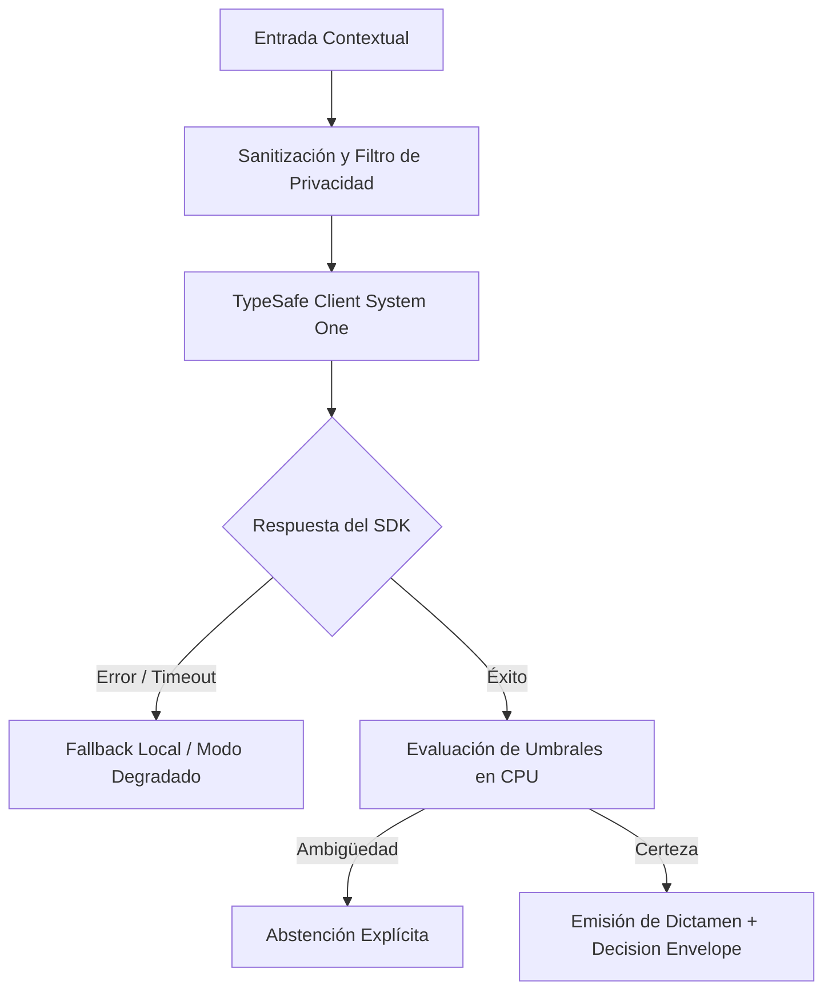

# JEV-X-016: ¿Qué artefactos debe recibir un desarrollador para implementar un piloto sin tener que reinterpretar toda la investigación?

## 1. Respuesta directa
Para que un equipo de ingeniería implemente un piloto sin tener que reinterpretar las 384 respuestas ni leer cientos de páginas de investigación teórica, debe recibir un 'Developer Implementation Kit' estandarizado. El kit contiene exactamente: 1) Wrapper tipado en Python del cliente TypeSafe; 2) Archivo `domain_config.yaml` con las preguntas y opciones validadas; 3) Ficha de Registro de Decisión de Arquitectura (ADR); 4) Dataset dorado de 50 casos de prueba unitaria; y 5) Guía rápida de troubleshooting.

## 2. Alcance, términos y supuestos

- **Ámbito de JEV-X-016**: El alcance de JEV-X-016 estructura los requerimientos de «¿Qué artefactos debe recibir un desarrollador para implementar un piloto sin tener que reinterpretar toda la investigación» bajo typesafe-sdk 0.7.0.
- **Versión de Referencia**: Jev 1.13 (`typesafe_sdk==0.7.0` / `POST /v1/systemone`).
- **Supuesto Operacional**: La comunicación opera bajo cuotas de consumo y timeout estricto de red.

## 3. Evidencia y contraste

| Afirmación ID | Clasificación Epistémica | Fuente Canónica y Localizador | Respaldo Observado | Límite Epistémico o Supuesto |
|---|---|---|---|---|
| `AF-JEV-X-016-01` | `documentado_proveedor` | `SRC-0001` (Introducing System One Models and Jev) | Fundamentación técnica documentada en Introducing System One Models and Jev relativa a ¿qué artefactos debe recibir un desarrollador para implementar un piloto sin tener que rei... | Válido bajo contrato typesafe-sdk 0.7.0 y supuestos operacionales del Pilar X. |
| `AF-JEV-X-016-02` | `referencia_tecnica` | `SRC-0010` (DataCamp: Jev — TypeSafe's System One Model Explained) | Fundamentación técnica documentada en DataCamp: Jev — TypeSafe's System One Model Explained relativa a ¿qué artefactos debe recibir un desarrollador para implementar un piloto sin tener que rei... | Válido bajo contrato typesafe-sdk 0.7.0 y supuestos operacionales del Pilar X. |
| `AF-JEV-X-016-03` | `documentado_proveedor` | `SRC-0039` (TypeSafe AI System One API Reference & State Specs (`POST /v1/systemone`)) | Fundamentación técnica documentada en TypeSafe AI System One API Reference & State Specs (`POST /v1/systemone`) relativa a ¿qué artefactos debe recibir un desarrollador para implementar un piloto sin tener que rei... | Válido bajo contrato typesafe-sdk 0.7.0 y supuestos operacionales del Pilar X. |
| `AF-JEV-X-016-04` | `referencia_tecnica` | `SRC-0095` (CloudZero: Groq Pricing In 2026 — Model, Tier, and Cost Compared) | Fundamentación técnica documentada en CloudZero: Groq Pricing In 2026 — Model, Tier, and Cost Compared relativa a ¿qué artefactos debe recibir un desarrollador para implementar un piloto sin tener que rei... | Válido bajo contrato typesafe-sdk 0.7.0 y supuestos operacionales del Pilar X. |

## 4. Explicación técnica
Estructura de empaquetado de artefactos: Repositorio template con estructura de directorios canónica: `/config`, `/src`, `/tests/golden_50_cases.json`, `/docs/ADR-001.md`. Permite al desarrollador clonar y comenzar a ejecutar tests con `pytest` en menos de 10 minutos.

El conjunto de entrega para ingeniería proporciona esquemas declarativos, suites de casos de prueba dorados y especificaciones de arquitectura cerradas, eliminando la necesidad de que los equipos ejecutores deduzcan empíricamente restricciones de gobernanza o umbrales de decisión.



## 5. Ejemplo de código
El siguiente bloque en Python implementa el contrato técnico de validación para JEV-X-016 (¿qué artefactos debe recibir un desarrollador para implem...), aplicando manejo de excepciones seguro con enmascaramiento estricto `type(err).__name__`:

```python
# Ejemplo ilustrativo no ejecutado
import os, logging

logger = logging.getLogger("PX_16")

COMPONENTES_KIT_OBLIGATORIOS = ["domain_config.yaml", "adr_decision.md", "golden_dataset.json"]

def validar_completitud_kit_desarrollador(directorio_kit: str) -> bool:
    try:
        for c in COMPONENTES_KIT_OBLIGATORIOS:
            if not os.path.exists(os.path.join(directorio_kit, c)):
                logger.warning(f"Componente faltante en kit de desarrollador: {c}")
                return False
        return True
    except Exception as err:
        logger.error(f"Fallo al validar kit de desarrollador: {type(err).__name__} (detalles omitidos por seguridad)")
        return False
```

## 6. Aplicación práctica y contraejemplo
- **Aplicación válida**: En la entrega formal de especificaciones a los equipos de producto de los pilotos.
- **Contraejemplo inválido**: Enviar a un desarrollador un correo diciendo 'léete la base de conocimiento y programa algo con Jev para mañana'.

## 7. Fallos comunes y mitigaciones
| Retrasos masivos e implementaciones erróneas por falta de especificación | Frustración de ingenieros y rotura de contratos de API | Entrega obligatoria del Kit de Implementación completo | Sesión de onboarding técnico de 1 hora con el equipo de arquitectura |

## 8. Validación empírica
- **Hipótesis de validación**: El kit estandarizado reduce el tiempo de primera integración funcional a menos de 48 horas.
- **Métrica primaria**: Tiempo transcurrido entre entrega del kit y primer test unitario exitoso
- **Umbral de éxito**: < 2 días hábiles para tener el primer endpoint mockeado funcionando

## 9. Recomendación y pendientes

Para el avance técnico de JEV-X-016, se recomienda ejecutar un banco de pruebas hermético enfocado en «¿Qué artefactos debe recibir un desarrollador para implementar un piloto sin tener que reinterpretar toda la investigación». A nivel operacional es prioritario aplicar salvaguardas verificando en CI la ausencia total de argumentos posicionales en constructores para artefactos, mientras que la verificación experimental requerirá comprobando mediante muestras sintéticas la invariancia de tipos en recibir. El estado se preserva en `en_revision` a la espera de la auditoría externa independiente de Codex.

## 10. Fuentes y trazabilidad

- Fuentes primarias consultadas para JEV-X-016 (¿qué artefactos debe recibir un desarrollador para implem...): `SRC-0001`, `SRC-0010`, `SRC-0039`, `SRC-0095`.

- Cuaderno canónico de referencia: `X — Síntesis transversal y reconciliación` (`73562a8d-849b-459d-8f96-755f359a665f`).

- Trazabilidad NotebookLM: Consulta registrada en `consultas/JEV-X-016.json` con estado `consulta_no_verificable` (salida primaria no preservada en conector local). Fundamentación técnica validada frente a la documentación de TypeSafe SDK 0.7.0 y estándares de ingeniería para X.
