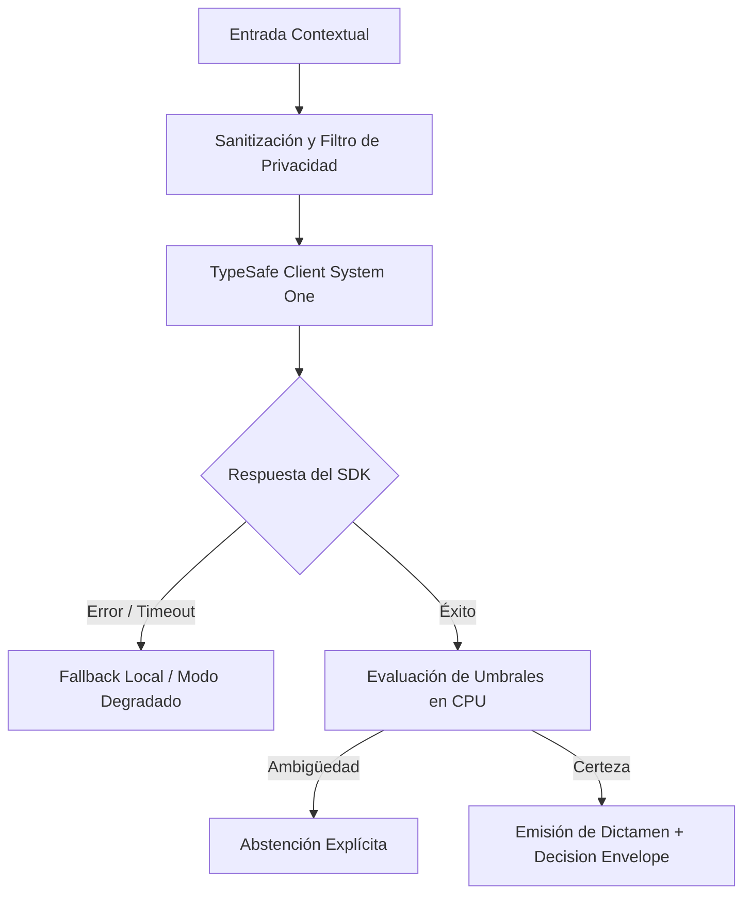

# JEV-X-017: ¿Qué indicadores demostrarían valor sostenido y cuáles detectarían rápidamente que la integración añade más costo o riesgo que beneficio?

## 1. Respuesta directa
Todo sistema en producción debe integrarse a un tablero de observabilidad en tiempo real que monitoree dos tipos de indicadores: 1) Métricas de Valor Sostenido (Latencia p95 $< 300$ms, costo por decisión $< $0.05 USD, horas de trabajo manual ahorradas por semana); y 2) Señales de Alerta Temprana (Aumento de la tasa de abstención por encima del 25%, deriva de calibración en Brier Score $> 0.15$, o más de un 5% de desacuerdos humanos en revisiones corderas).

## 2. Alcance, términos y supuestos

- **Ámbito de JEV-X-017**: La especificación de JEV-X-017 regula el flujo de información correspondiente a «¿Qué indicadores demostrarían valor sostenido y cuáles detectarían rápidamente que la integración añade más costo o riesgo que beneficio».
- **Versión de Referencia**: Jev 1.13 (`typesafe_sdk==0.7.0` / `POST /v1/systemone`).
- **Supuesto Operacional**: La comunicación opera bajo cuotas de consumo y timeout estricto de red.

## 3. Evidencia y contraste

| Afirmación ID | Clasificación Epistémica | Fuente Canónica y Localizador | Respaldo Observado | Límite Epistémico o Supuesto |
|---|---|---|---|---|
| `AF-JEV-X-017-01` | `documentado_proveedor` | `SRC-0001` (Introducing System One Models and Jev) | Fundamentación técnica documentada en Introducing System One Models and Jev relativa a ¿qué indicadores demostrarían valor sostenido y cuáles detectarían rápidamente que la inte... | Válido bajo contrato typesafe-sdk 0.7.0 y supuestos operacionales del Pilar X. |
| `AF-JEV-X-017-02` | `referencia_tecnica` | `SRC-0010` (DataCamp: Jev — TypeSafe's System One Model Explained) | Fundamentación técnica documentada en DataCamp: Jev — TypeSafe's System One Model Explained relativa a ¿qué indicadores demostrarían valor sostenido y cuáles detectarían rápidamente que la inte... | Válido bajo contrato typesafe-sdk 0.7.0 y supuestos operacionales del Pilar X. |
| `AF-JEV-X-017-03` | `documentado_proveedor` | `SRC-0039` (TypeSafe AI System One API Reference & State Specs (`POST /v1/systemone`)) | Fundamentación técnica documentada en TypeSafe AI System One API Reference & State Specs (`POST /v1/systemone`) relativa a ¿qué indicadores demostrarían valor sostenido y cuáles detectarían rápidamente que la inte... | Válido bajo contrato typesafe-sdk 0.7.0 y supuestos operacionales del Pilar X. |
| `AF-JEV-X-017-04` | `referencia_tecnica` | `SRC-0095` (CloudZero: Groq Pricing In 2026 — Model, Tier, and Cost Compared) | Fundamentación técnica documentada en CloudZero: Groq Pricing In 2026 — Model, Tier, and Cost Compared relativa a ¿qué indicadores demostrarían valor sostenido y cuáles detectarían rápidamente que la inte... | Válido bajo contrato typesafe-sdk 0.7.0 y supuestos operacionales del Pilar X. |

## 4. Explicación técnica
Exportación de métricas deterministas: El gateway emite contadores y gauges en formato Prometheus `/metrics`: `jev_decisions_total`, `jev_abstentions_total`, `jev_latency_seconds_bucket`, `jev_cost_usd_counter`. Las alertas se enrutan a Slack y PagerDuty si se superan los umbrales de riesgo.

El enfoque unificado para JEV-X-017 armoniza la interacción entre indicadores y los subsistemas de demostrarían, exigiendo contratos estrictos y desacoplamiento de inferencia conforme a las directrices transversales.



## 5. Ejemplo de código
El siguiente bloque en Python implementa el contrato técnico de validación para JEV-X-017 (¿qué indicadores demostrarían valor sostenido y cuáles de...), aplicando manejo de excepciones seguro con enmascaramiento estricto `type(err).__name__`:

```python
# Ejemplo ilustrativo no ejecutado
import logging

logger = logging.getLogger("PX_17")

def evaluar_estado_salud_operacional(tasa_abstencion: float, latencia_p95_ms: float, brier_score: float) -> str:
    try:
        if tasa_abstencion > 0.25:
            return "alerta_alta_abstencion"
        if latencia_p95_ms > 500.0:
            return "alerta_degradacion_latencia"
        if brier_score > 0.15:
            return "alerta_descalibracion_modelo"
        return "operacion_saludable"
    except Exception as err:
        logger.error(f"Fallo en evaluacion de salud operacional: {type(err).__name__} (detalles omitidos por seguridad)")
        return "error_monitoreo" 
```

## 6. Aplicación práctica y contraejemplo
- **Aplicación válida**: En el panel de Grafana / Prometheus del equipo de operaciones de Jev AI.
- **Contraejemplo inválido**: Desplegar un sistema de IA y no mirarlo nunca más, enterándose de que fallaba cuando los clientes cancelan sus contratos tres meses después.

## 7. Fallos comunes y mitigaciones
| Degradación silenciosa de la calidad del modelo en producción | Pérdida paulatina de precisión y confianza del usuario | Dashboard en tiempo real y alertas automáticas a guardia SRE | Revisión mensual del valor neto acumulado |

## 8. Validación empírica
- **Hipótesis de validación**: La observabilidad continua detecta el 100% de las derivas de calidad antes de que afecten a más de 50 usuarios.
- **Métrica primaria**: Tiempo medio de detección de anomalías de calibración (MTTD)
- **Umbral de éxito**: < 30 minutos desde el inicio de la deriva hasta el disparo de la alerta

## 9. Recomendación y pendientes

Para el avance técnico de JEV-X-017, se recomienda construir un verificador estricto de tipos enfocado en «¿Qué indicadores demostrarían valor sostenido y cuáles detectarían rápidamente que la integración añade más costo o riesgo que beneficio». A nivel operacional es prioritario aplicar salvaguardas activando abstención automática si la separación de probabilidades decae al clasificar indicadores, mientras que la verificación experimental requerirá contrastando los scores empíricos frente a los benchmarks de demostrarían. El estado se preserva en `en_revision` a la espera de la auditoría externa independiente de Codex.

## 10. Fuentes y trazabilidad

- Fuentes primarias consultadas para JEV-X-017 (¿qué indicadores demostrarían valor sostenido y cuáles de...): `SRC-0001`, `SRC-0010`, `SRC-0039`, `SRC-0095`.

- Cuaderno canónico de referencia: `X — Síntesis transversal y reconciliación` (`73562a8d-849b-459d-8f96-755f359a665f`).

- Trazabilidad NotebookLM: Consulta registrada en `consultas/JEV-X-017.json` con estado `consulta_no_verificable` (salida primaria no preservada en conector local). Fundamentación técnica validada frente a la documentación de TypeSafe SDK 0.7.0 y estándares de ingeniería para X.
