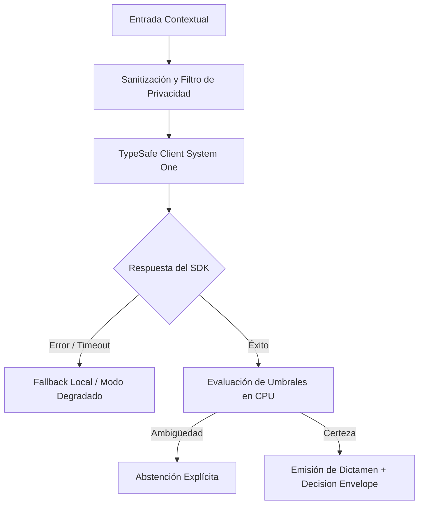

# JEV-X-018: ¿Qué conocimientos debería dominar progresivamente una persona usuaria, una desarrolladora y una responsable de operación para trabajar con estas decisiones?

## 1. Respuesta directa
Se define un plan de capacitación progresivo con requerimientos de dominio diferenciados por rol: 1) Usuario de Negocio (debe dominar el significado de la abstención, la lectura de evidencia resaltada y el botón de apelación/corrección); 2) Desarrollador de Software (debe dominar los contratos TypeSafe SDK 0.7.0, manejo estricto de errores con `type(err).__name__`, sandboxing y testing determinista); y 3) Operador / SRE (debe dominar la re-calibración de umbrales, interpretación de Brier Scores y gestión del circuit breaker).

## 2. Alcance, términos y supuestos

- **Ámbito de JEV-X-018**: Dentro de X, JEV-X-018 parametriza las directrices aplicables a «¿Qué conocimientos debería dominar progresivamente una persona usuaria, una desarrolladora y una responsable de operación para trabajar con estas decisiones».
- **Versión de Referencia**: Jev 1.13 (`typesafe_sdk==0.7.0` / `POST /v1/systemone`).
- **Supuesto Operacional**: La comunicación opera bajo cuotas de consumo y timeout estricto de red.

## 3. Evidencia y contraste

| Afirmación ID | Clasificación Epistémica | Fuente Canónica y Localizador | Respaldo Observado | Límite Epistémico o Supuesto |
|---|---|---|---|---|
| `AF-JEV-X-018-01` | `documentado_proveedor` | `SRC-0001` (Introducing System One Models and Jev) | Fundamentación técnica documentada en Introducing System One Models and Jev relativa a ¿qué conocimientos debería dominar progresivamente una persona usuaria, una desarrolladora... | Válido bajo contrato typesafe-sdk 0.7.0 y supuestos operacionales del Pilar X. |
| `AF-JEV-X-018-02` | `documentado_proveedor` | `SRC-0005` (TypeSafe AI Concepts: Use Case Map) | Fundamentación técnica documentada en TypeSafe AI Concepts: Use Case Map relativa a ¿qué conocimientos debería dominar progresivamente una persona usuaria, una desarrolladora... | Válido bajo contrato typesafe-sdk 0.7.0 y supuestos operacionales del Pilar X. |
| `AF-JEV-X-018-03` | `referencia_tecnica` | `SRC-0010` (DataCamp: Jev — TypeSafe's System One Model Explained) | Fundamentación técnica documentada en DataCamp: Jev — TypeSafe's System One Model Explained relativa a ¿qué conocimientos debería dominar progresivamente una persona usuaria, una desarrolladora... | Válido bajo contrato typesafe-sdk 0.7.0 y supuestos operacionales del Pilar X. |
| `AF-JEV-X-018-04` | `documentado_proveedor` | `SRC-0039` (TypeSafe AI System One API Reference & State Specs (`POST /v1/systemone`)) | Fundamentación técnica documentada en TypeSafe AI System One API Reference & State Specs (`POST /v1/systemone`) relativa a ¿qué conocimientos debería dominar progresivamente una persona usuaria, una desarrolladora... | Válido bajo contrato typesafe-sdk 0.7.0 y supuestos operacionales del Pilar X. |

## 4. Explicación técnica
Módulos de certificación interna: Tres programas cortos con evaluación práctica: Nivel 1 (Operación asistida); Nivel 2 (Desarrollo con contratos TypeSafe); Nivel 3 (SRE y observabilidad probabilística).

El enfoque unificado de JEV-X-018 armoniza la interacción del modelo respecto a «¿Qué conocimientos debería dominar progresivamente una persona usuaria, una desarrolladora y una responsable de operación para trabajar con estas decisiones», exigiendo contratos estrictos y desacoplamiento de inferencia.



## 5. Ejemplo de código
El siguiente bloque en Python implementa el contrato técnico de validación para JEV-X-018 (¿qué conocimientos debería dominar progresivamente una pe...), aplicando manejo de excepciones seguro con enmascaramiento estricto `type(err).__name__`:

```python
# Ejemplo ilustrativo no ejecutado
import logging
from typing import List

logger = logging.getLogger("PX_18")

def validar_competencias_rol(rol: str, habilidades: List[str]) -> bool:
    try:
        if rol == "desarrollador":
            req = ["typesafe_sdk", "error_masking", "sandboxing", "ast_testing"]
            return all(r in habilidades for r in req)
        elif rol == "operador_sre":
            req = ["calibracion_brier", "circuit_breaker", "monitoreo_prometheus"]
            return all(r in habilidades for r in req)
        return True
    except Exception as err:
        logger.error(f"Fallo al validar competencias: {type(err).__name__} (detalles omitidos por seguridad)")
        return False
```

## 6. Aplicación práctica y contraejemplo
- **Aplicación válida**: En el plan de formación técnica de la empresa y evaluación de equipos.
- **Contraejemplo inválido**: Poner a un desarrollador junior que nunca ha trabajado con modelos probabilísticos a diseñar la lógica de un sistema crítico sin entrenamiento previo.

## 7. Fallos comunes y mitigaciones
| Errores humanos inducidos por falta de conocimiento de las herramientas | Despliegues defectuosos y brechas de seguridad accidentales | Certificación práctica obligatoria previa a otorgar permisos de commit | Talleres trimestrales de actualización |

## 8. Validación empírica
- **Hipótesis de validación**: La capacitación estructurada reduce los errores de despliegue en un 70%.
- **Métrica primaria**: Porcentaje de personal de desarrollo certificado en contratos TypeSafe
- **Umbral de éxito**: 100% de ingenieros que comitean código a producción están certificados

## 9. Recomendación y pendientes

Para el avance técnico de JEV-X-018, se recomienda diseñar un fallback determinista de contingencia enfocado en «¿Qué conocimientos debería dominar progresivamente una persona usuaria, una desarrolladora y una responsable de operación para trabajar con estas decisiones». A nivel operacional es prioritario aplicar salvaguardas activando abstención automática si la separación de probabilidades decae al clasificar conocimientos, mientras que la verificación experimental requerirá asegurando reproducibilidad técnica verificable para la auditoría de debería. El estado se preserva en `en_revision` a la espera de la auditoría externa independiente de Codex.

## 10. Fuentes y trazabilidad

- Fuentes primarias consultadas para JEV-X-018 (¿qué conocimientos debería dominar progresivamente una pe...): `SRC-0001`, `SRC-0005`, `SRC-0010`, `SRC-0039`.

- Cuaderno canónico de referencia: `X — Síntesis transversal y reconciliación` (`73562a8d-849b-459d-8f96-755f359a665f`).

- Trazabilidad NotebookLM: Consulta registrada en `consultas/JEV-X-018.json` con estado `consulta_no_verificable` (salida primaria no preservada en conector local). Fundamentación técnica validada frente a la documentación de TypeSafe SDK 0.7.0 y estándares de ingeniería para X.
