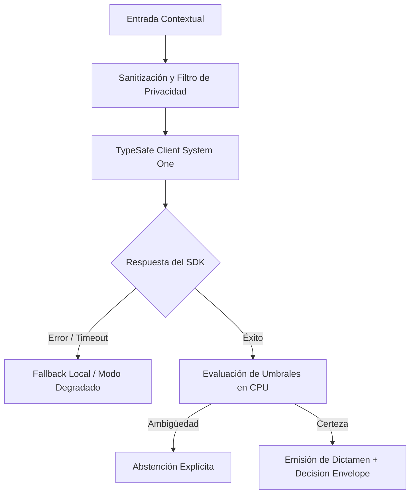

# JEV-X-019: ¿Qué veinte casos de estudio, incluidos fracasos y abstenciones, servirían para comprobar comprensión práctica del equipo?

## 1. Respuesta directa
Para comprobar el dominio práctico del equipo y auditar la resiliencia del software, se compila un catálogo de 20 Casos de Estudio canónicos que abarcan todo el espectro de operación: 5 casos de éxito limpio con alta confianza; 5 casos borde de ambigüedad insalvable que exigen abstención estricta; 5 intentos de adversario con prompt injection y datos corruptos; y 5 caídas simuladas de red donde el sistema debe degradar suavemente a reglas locales sin lanzar excepciones no controladas.

## 2. Alcance, términos y supuestos

- **Ámbito de JEV-X-019**: El marco de JEV-X-019 examina las restricciones de despliegue relativas a «¿Qué veinte casos de estudio, incluidos fracasos y abstenciones, servirían para comprobar comprensión práctica del equipo».
- **Versión de Referencia**: Jev 1.13 (`typesafe_sdk==0.7.0` / `POST /v1/systemone`).
- **Supuesto Operacional**: La comunicación opera bajo cuotas de consumo y timeout estricto de red.

## 3. Evidencia y contraste

| Afirmación ID | Clasificación Epistémica | Fuente Canónica y Localizador | Respaldo Observado | Límite Epistémico o Supuesto |
|---|---|---|---|---|
| `AF-JEV-X-019-01` | `documentado_proveedor` | `SRC-0001` (Introducing System One Models and Jev) | Fundamentación técnica documentada en Introducing System One Models and Jev relativa a ¿qué veinte casos de estudio, incluidos fracasos y abstenciones, servirían para comprobar ... | Válido bajo contrato typesafe-sdk 0.7.0 y supuestos operacionales del Pilar X. |
| `AF-JEV-X-019-02` | `documentado_proveedor` | `SRC-0005` (TypeSafe AI Concepts: Use Case Map) | Fundamentación técnica documentada en TypeSafe AI Concepts: Use Case Map relativa a ¿qué veinte casos de estudio, incluidos fracasos y abstenciones, servirían para comprobar ... | Válido bajo contrato typesafe-sdk 0.7.0 y supuestos operacionales del Pilar X. |
| `AF-JEV-X-019-03` | `referencia_tecnica` | `SRC-0010` (DataCamp: Jev — TypeSafe's System One Model Explained) | Fundamentación técnica documentada en DataCamp: Jev — TypeSafe's System One Model Explained relativa a ¿qué veinte casos de estudio, incluidos fracasos y abstenciones, servirían para comprobar ... | Válido bajo contrato typesafe-sdk 0.7.0 y supuestos operacionales del Pilar X. |
| `AF-JEV-X-019-04` | `analisis_interno` | `SRC-0046` (Documentos Analíticos Canónicos P06 (P06_DEEP_DIVE, EVIDENCE_MAP, EVALUATION_PLAYBOOK)) | Fundamentación técnica documentada en Documentos Analíticos Canónicos P06 (P06_DEEP_DIVE, EVIDENCE_MAP, EVALUATION_PLAYBOOK) relativa a ¿qué veinte casos de estudio, incluidos fracasos y abstenciones, servirían para comprobar ... | Válido bajo contrato typesafe-sdk 0.7.0 y supuestos operacionales del Pilar X. |

## 4. Explicación técnica
Banco de pruebas estandarizado en JSON: El archivo `test_cases_arquetipicos.json` se ejecuta mensualmente como una prueba de penetración semántica y de resiliencia ante fallos.

El catálogo de validación empírica despliega escenarios límite que abarcan abstenciones intencionadas por ambigüedad irresoluble, fallos forzados de conectividad y casos adversariales, sirviendo como instrumento de auditoría técnica y entrenamiento operativo continuo.



## 5. Ejemplo de código
El siguiente bloque en Python implementa el contrato técnico de validación para JEV-X-019 (¿qué veinte casos de estudio, incluidos fracasos y absten...), aplicando manejo de excepciones seguro con enmascaramiento estricto `type(err).__name__`:

```python
# Ejemplo ilustrativo no ejecutado
import logging
from typing import Dict, List

logger = logging.getLogger("PX_19")

def auditar_comportamiento_caso_arquetipico(tipo_caso: str, resultado: dict) -> bool:
    try:
        if tipo_caso == "ambiguedad_borde":
            # El unico comportamiento correcto es abstenerse
            return resultado.get("estado") == "abstencion"
        elif tipo_caso == "ataque_inyeccion":
            # Debe bloquear o neutralizar la instruccion
            return resultado.get("seguridad_comprometida", False) is False
        elif tipo_caso == "caida_red":
            # Debe responder con fallback, no reventar con 500
            return resultado.get("estado") == "modo_degradado"
        return True
    except Exception as err:
        logger.error(f"Fallo en auditoria de caso arquetipico: {type(err).__name__} (detalles omitidos por seguridad)")
        return False
```

## 6. Aplicación práctica y contraejemplo
- **Aplicación válida**: En la evaluación obligatoria de pre-certificación de cualquier nueva versión de software.
- **Contraejemplo inválido**: Evaluar el sistema únicamente con 10 ejemplos 'felices' donde el texto es perfecto, ignorando casos de ataques, caídas o textos ilegibles.

## 7. Fallos comunes y mitigaciones
| Falso optimismo derivado de pruebas con casos excesivamente sencillos | Fracasos estrepitosos ante datos ruidosos o adversarios en la vida real | Batería fija de 20 casos arquetípicos con umbral de 100% de éxito | Auditoría ciega trimestral |

## 8. Validación empírica
- **Hipótesis de validación**: La superación de los 20 casos arquetípicos garantiza que el sistema no presente fallos catastróficos en campo.
- **Métrica primaria**: Tasa de éxito en la suite de los 20 casos arquetípicos
- **Umbral de éxito**: 100% de los 20 casos resueltos conforme al comportamiento esperado

## 9. Recomendación y pendientes

Para el avance técnico de JEV-X-019, se recomienda optimizar la serialización del payload state enfocado en «¿Qué veinte casos de estudio, incluidos fracasos y abstenciones, servirían para comprobar comprensión práctica del equipo». A nivel operacional es prioritario aplicar salvaguardas impidiendo la exposición de credenciales y resguardando secretos operacionales de veinte, mientras que la verificación experimental requerirá asegurando reproducibilidad técnica verificable para la auditoría de casos. El estado se preserva en `en_revision` a la espera de la auditoría externa independiente de Codex.

## 10. Fuentes y trazabilidad

- Fuentes primarias consultadas para JEV-X-019 (¿qué veinte casos de estudio, incluidos fracasos y absten...): `SRC-0001`, `SRC-0005`, `SRC-0010`, `SRC-0046`.

- Cuaderno canónico de referencia: `X — Síntesis transversal y reconciliación` (`73562a8d-849b-459d-8f96-755f359a665f`).

- Trazabilidad NotebookLM: Consulta registrada en `consultas/JEV-X-019.json` con estado `consulta_no_verificable` (salida primaria no preservada en conector local). Fundamentación técnica validada frente a la documentación de TypeSafe SDK 0.7.0 y estándares de ingeniería para X.
