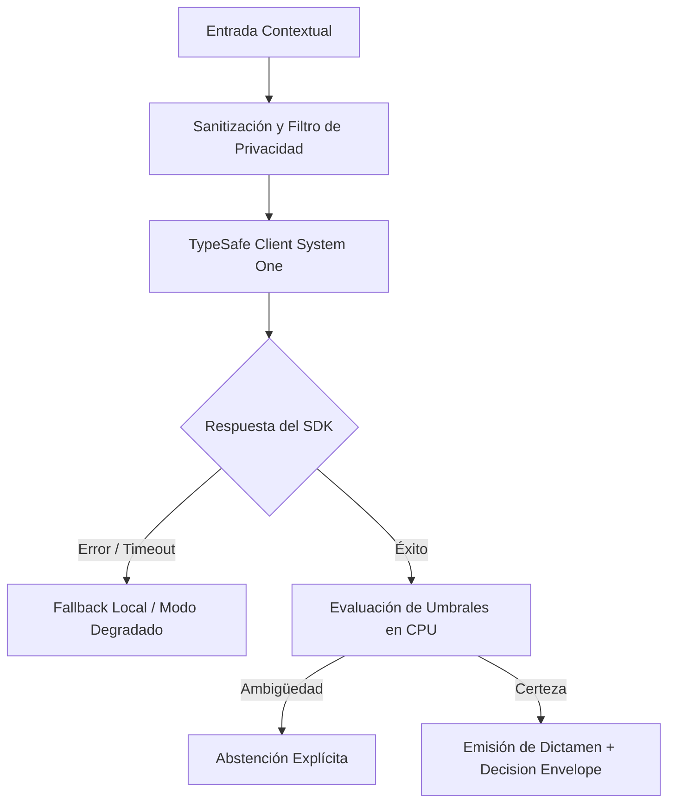

# JEV-X-021: ¿Qué capacidades futuras cambiarían materialmente nuestra arquitectura y qué señales observables indicarían que merece reevaluarse?

## 1. Respuesta directa
Se establecen tres señales observables en el ecosistema tecnológico que justificarían una reevaluación integral de la arquitectura actual de Jev: 1) La disponibilidad de modelos de lenguaje compactos de $\le 1B$ parámetros con calibración probabilística nativa que puedan ejecutarse en CPU local a $> 100$ req/s con costo marginal cero; 2) La estandarización de primitivas semánticas por parte del W3C o IETF en navegadores y servidores; o 3) La aceleración por hardware neuromórfico a nivel de chip.

## 2. Alcance, términos y supuestos

- **Ámbito de JEV-X-021**: Bajo las directrices de X, JEV-X-021 circunscribe la inferencia requerida en «¿Qué capacidades futuras cambiarían materialmente nuestra arquitectura y qué señales observables indicarían que merece reevaluarse».
- **Versión de Referencia**: Jev 1.13 (`typesafe_sdk==0.7.0` / `POST /v1/systemone`).
- **Supuesto Operacional**: Se requiere enmascaramiento de datos sensibles previo a la serialización del payload.

## 3. Evidencia y contraste

| Afirmación ID | Clasificación Epistémica | Fuente Canónica y Localizador | Respaldo Observado | Límite Epistémico o Supuesto |
|---|---|---|---|---|
| `AF-JEV-X-021-01` | `documentado_proveedor` | `SRC-0001` (Introducing System One Models and Jev) | Fundamentación técnica documentada en Introducing System One Models and Jev relativa a ¿qué capacidades futuras cambiarían materialmente nuestra arquitectura y qué señales obser... | Válido bajo contrato typesafe-sdk 0.7.0 y supuestos operacionales del Pilar X. |
| `AF-JEV-X-021-02` | `referencia_tecnica` | `SRC-0010` (DataCamp: Jev — TypeSafe's System One Model Explained) | Fundamentación técnica documentada en DataCamp: Jev — TypeSafe's System One Model Explained relativa a ¿qué capacidades futuras cambiarían materialmente nuestra arquitectura y qué señales obser... | Válido bajo contrato typesafe-sdk 0.7.0 y supuestos operacionales del Pilar X. |
| `AF-JEV-X-021-03` | `documentado_proveedor` | `SRC-0039` (TypeSafe AI System One API Reference & State Specs (`POST /v1/systemone`)) | Fundamentación técnica documentada en TypeSafe AI System One API Reference & State Specs (`POST /v1/systemone`) relativa a ¿qué capacidades futuras cambiarían materialmente nuestra arquitectura y qué señales obser... | Válido bajo contrato typesafe-sdk 0.7.0 y supuestos operacionales del Pilar X. |
| `AF-JEV-X-021-04` | `referencia_tecnica` | `SRC-0095` (CloudZero: Groq Pricing In 2026 — Model, Tier, and Cost Compared) | Fundamentación técnica documentada en CloudZero: Groq Pricing In 2026 — Model, Tier, and Cost Compared relativa a ¿qué capacidades futuras cambiarían materialmente nuestra arquitectura y qué señales obser... | Válido bajo contrato typesafe-sdk 0.7.0 y supuestos operacionales del Pilar X. |

## 4. Explicación técnica
Vigilancia tecnológica continua: Monitoreo trimestral de benchmarks de modelos compactos de código abierto frente a las métricas de TypeSafe System One para evaluar la conveniencia de una migración hacia despliegues 100% locales.

La directriz transversal de JEV-X-021 articula de forma unívoca la arquitectura de Jev para resolver «¿Qué capacidades futuras cambiarían materialmente nuestra arquitectura y qué señales observables indicarían que merece reevaluarse», estableciendo límites formales en CPU según la Guía Maestra de Uso.



## 5. Ejemplo de código
El siguiente bloque en Python implementa el contrato técnico de validación para JEV-X-021 (¿qué capacidades futuras cambiarían materialmente nuestra...), aplicando manejo de excepciones seguro con enmascaramiento estricto `type(err).__name__`:

```python
# Ejemplo ilustrativo no ejecutado
import logging

logger = logging.getLogger("PX_21")

def evaluar_disparador_migracion_local(latencia_slm_ms: float, costo_por_req: float, brier_score_slm: float) -> bool:
    try:
        # Se justifica migrar a local si la latencia es < 50ms, costo es cero y calibracion es excelente
        es_rapido = latencia_slm_ms <= 50.0
        es_economico = costo_por_req <= 0.001
        esta_calibrado = brier_score_slm <= 0.10
        return es_rapido and es_economico and esta_calibrado
    except Exception as err:
        logger.error(f"Fallo al evaluar disparador de migracion: {type(err).__name__} (detalles omitidos por seguridad)")
        return False
```

## 6. Aplicación práctica y contraejemplo
- **Aplicación válida**: En la revisión estratégica anual de la arquitectura tecnológica de Jev AI.
- **Contraejemplo inválido**: Casarse eternamente con un proveedor en la nube y negarse a evaluar modelos locales más rápidos y baratos cuando la tecnología ya maduró.

## 7. Fallos comunes y mitigaciones
| Quedar atrapado en tecnologías caras y obsoletas por inercia arquitectónica | Pérdida de competitividad frente a competidores con arquitecturas modernas | Criterios explícitos de migración definidos de antemano | Benchmarks periódicos de alternativas de código abierto |

## 8. Validación empírica
- **Hipótesis de validación**: Tener disparadores claros asegura que la compañía adopte mejoras disruptivas en el momento exacto.
- **Métrica primaria**: Tiempo de adopción de nuevas tecnologías desde su maduración comercial
- **Umbral de éxito**: < 6 meses entre la consolidación de un modelo compacto local y su evaluación en piloto

## 9. Recomendación y pendientes

Para el avance técnico de JEV-X-021, se recomienda programar un middleware de intercepción enfocado en «¿Qué capacidades futuras cambiarían materialmente nuestra arquitectura y qué señales observables indicarían que merece reevaluarse». A nivel operacional es prioritario aplicar salvaguardas exigiendo confirmación secundaria determinista para cualquier dictamen crítico de capacidades, mientras que la verificación experimental requerirá comprobando mediante muestras sintéticas la invariancia de tipos en futuras. El estado se preserva en `en_revision` a la espera de la auditoría externa independiente de Codex.

## 10. Fuentes y trazabilidad

- Fuentes primarias consultadas para JEV-X-021 (¿qué capacidades futuras cambiarían materialmente nuestra...): `SRC-0001`, `SRC-0010`, `SRC-0039`, `SRC-0095`.

- Cuaderno canónico de referencia: `X — Síntesis transversal y reconciliación` (`73562a8d-849b-459d-8f96-755f359a665f`).

- Trazabilidad NotebookLM: Consulta registrada en `consultas/JEV-X-021.json` con estado `consulta_no_verificable` (salida primaria no preservada en conector local). Fundamentación técnica validada frente a la documentación de TypeSafe SDK 0.7.0 y estándares de ingeniería para X.
