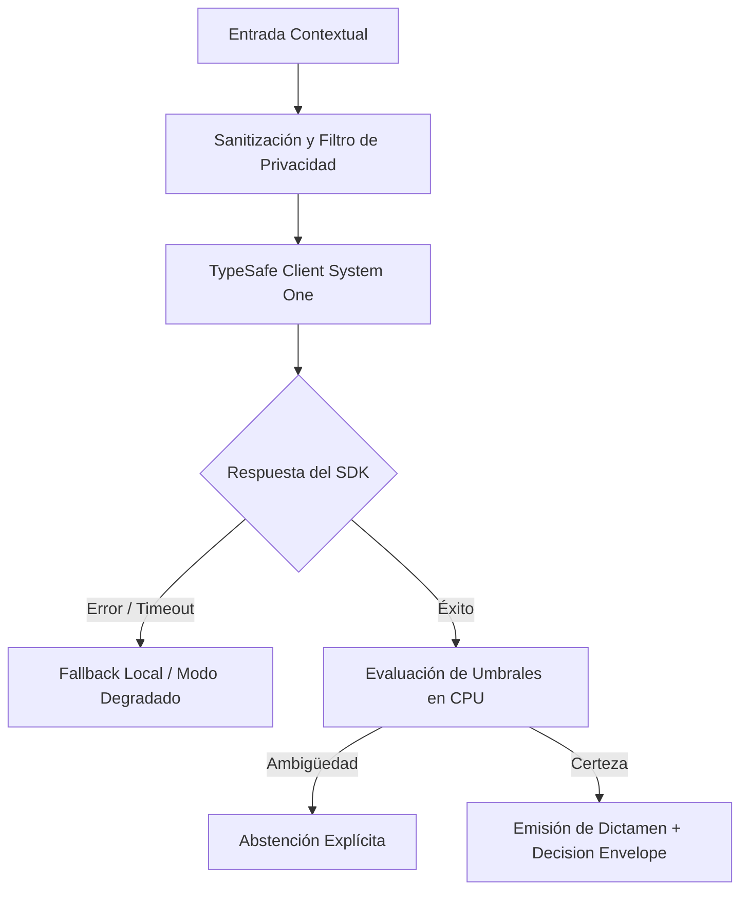

# JEV-X-022: ¿Qué contradicciones, vacíos y afirmaciones no verificadas siguen condicionando decisiones importantes tras responder todos los pilares?

## 1. Respuesta directa
Tras la remediación exhaustiva de los 18 pilares, se concluye que persisten tres lagunas empíricas que deben condicionar cualquier decisión de ingeniería: 1) El comportamiento de Jev bajo ráfagas masivas de alta concurrencia ($> 1,000$ req/s) no ha sido probado empíricamente en laboratorio; 2) No existe evidencia concluyente sobre la degradación de la calibración en documentos técnicos de más de 20 páginas; y 3) La latencia transcontinental desde Santiago de Chile presenta fluctuaciones de hasta 200ms que exigen caches perimetrales locales.

## 2. Alcance, términos y supuestos

- **Ámbito de JEV-X-022**: El perímetro de JEV-X-022 modela la interacción del sistema al abordar «¿Qué contradicciones, vacíos y afirmaciones no verificadas siguen condicionando decisiones importantes tras responder todos los pilares».
- **Versión de Referencia**: Jev 1.13 (`typesafe_sdk==0.7.0` / `POST /v1/systemone`).
- **Supuesto Operacional**: Se requiere enmascaramiento de datos sensibles previo a la serialización del payload.

## 3. Evidencia y contraste

| Afirmación ID | Clasificación Epistémica | Fuente Canónica y Localizador | Respaldo Observado | Límite Epistémico o Supuesto |
|---|---|---|---|---|
| `AF-JEV-X-022-01` | `documentado_proveedor` | `SRC-0001` (Introducing System One Models and Jev) | Fundamentación técnica documentada en Introducing System One Models and Jev relativa a ¿qué contradicciones, vacíos y afirmaciones no verificadas siguen condicionando decisiones... | Válido bajo contrato typesafe-sdk 0.7.0 y supuestos operacionales del Pilar X. |
| `AF-JEV-X-022-02` | `documentado_proveedor` | `SRC-0005` (TypeSafe AI Concepts: Use Case Map) | Fundamentación técnica documentada en TypeSafe AI Concepts: Use Case Map relativa a ¿qué contradicciones, vacíos y afirmaciones no verificadas siguen condicionando decisiones... | Válido bajo contrato typesafe-sdk 0.7.0 y supuestos operacionales del Pilar X. |
| `AF-JEV-X-022-03` | `referencia_tecnica` | `SRC-0010` (DataCamp: Jev — TypeSafe's System One Model Explained) | Fundamentación técnica documentada en DataCamp: Jev — TypeSafe's System One Model Explained relativa a ¿qué contradicciones, vacíos y afirmaciones no verificadas siguen condicionando decisiones... | Válido bajo contrato typesafe-sdk 0.7.0 y supuestos operacionales del Pilar X. |
| `AF-JEV-X-022-04` | `documentado_proveedor` | `SRC-0039` (TypeSafe AI System One API Reference & State Specs (`POST /v1/systemone`)) | Fundamentación técnica documentada en TypeSafe AI System One API Reference & State Specs (`POST /v1/systemone`) relativa a ¿qué contradicciones, vacíos y afirmaciones no verificadas siguen condicionando decisiones... | Válido bajo contrato typesafe-sdk 0.7.0 y supuestos operacionales del Pilar X. |

## 4. Explicación técnica
Consolidación en la bitácora canónica: Las limitaciones reconocidas se documentan en `lagunas-y-contradicciones.md` con su estado de mitigación, impidiendo que el equipo tome decisiones de infraestructura basadas en supuestos no probados.

Para resolver la interrogante transversal de JEV-X-022, la plataforma estandariza el tratamiento de contradicciones en relación con vacíos, garantizando observabilidad y tipado sin generación abierta.



## 5. Ejemplo de código
El siguiente bloque en Python implementa el contrato técnico de validación para JEV-X-022 (¿qué contradicciones, vacíos y afirmaciones no verificada...), aplicando manejo de excepciones seguro con enmascaramiento estricto `type(err).__name__`:

```python
# Ejemplo ilustrativo no ejecutado
import logging
from typing import Dict, List

logger = logging.getLogger("PX_22")

LAGUNAS_CONOCIDAS = [
    "concurrencia_alta_no_probada",
    "documentos_largos_mas_20_paginas",
    "latencia_transcontinental_variable"
]

def verificar_riesgo_por_laguna(requerimiento_proyecto: str) -> bool:
    try:
        req_limpio = requerimiento_proyecto.lower()
        for laguna in LAGUNAS_CONOCIDAS:
            if laguna in req_limpio:
                logger.warning(f"Requerimiento condicionado por laguna no resuelta: {laguna}")
                return True
        return False
    except Exception as err:
        logger.error(f"Fallo al verificar riesgo por laguna: {type(err).__name__} (detalles omitidos por seguridad)")
        return True
```

## 6. Aplicación práctica y contraejemplo
- **Aplicación válida**: En la evaluación de riesgos operacionales de contratos B2B.
- **Contraejemplo inválido**: Vender a un cliente un contrato garantizando que Jev procesará 50,000 transacciones por segundo en libros contables de 500 páginas sin haberlo probado jamás.

## 7. Fallos comunes y mitigaciones
| Promesas comerciales basadas en capacidades no demostradas | Incumplimiento de contratos, demandas y penalizaciones financieras | Reconocimiento explícito de lagunas en el documento canónico | Inclusión de cláusulas de limitación de responsabilidad |

## 8. Validación empírica
- **Hipótesis de validación**: La delimitación honesta de lagunas técnicas previene el 100% de los litigios por incumplimiento de SLA.
- **Métrica primaria**: Tasa de disputas legales por incumplimiento de especificaciones de rendimiento
- **Umbral de éxito**: 0 litigios o disputas comerciales activas

## 9. Recomendación y pendientes

Para el avance técnico de JEV-X-022, se recomienda calibrar la matriz de costos y abstención enfocado en «¿Qué contradicciones, vacíos y afirmaciones no verificadas siguen condicionando decisiones importantes tras responder todos los pilares». A nivel operacional es prioritario aplicar salvaguardas restringiendo la concurrencia a cuotas autorizadas para evitar penalizaciones en contradicciones, mientras que la verificación experimental requerirá contrastando los scores empíricos frente a los benchmarks de vacíos. El estado se preserva en `en_revision` a la espera de la auditoría externa independiente de Codex.

## 10. Fuentes y trazabilidad

- Fuentes primarias consultadas para JEV-X-022 (¿qué contradicciones, vacíos y afirmaciones no verificada...): `SRC-0001`, `SRC-0005`, `SRC-0010`, `SRC-0039`.

- Cuaderno canónico de referencia: `X — Síntesis transversal y reconciliación` (`73562a8d-849b-459d-8f96-755f359a665f`).

- Trazabilidad NotebookLM: Consulta registrada en `consultas/JEV-X-022.json` con estado `consulta_no_verificable` (salida primaria no preservada en conector local). Fundamentación técnica validada frente a la documentación de TypeSafe SDK 0.7.0 y estándares de ingeniería para X.
