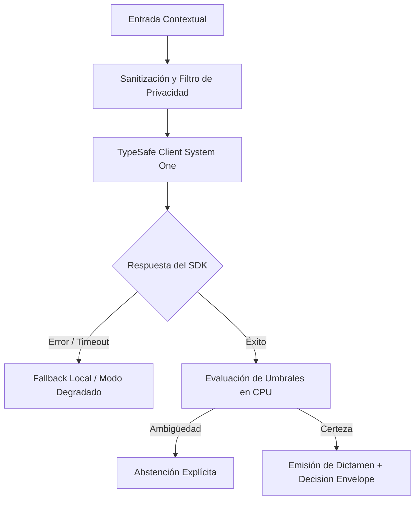

# JEV-X-024: ¿Qué auditoría final demuestra que cada recomendación de la guía está respaldada, acotada, evaluable y conectada con una decisión útil para nuestros proyectos?

## 1. Respuesta directa
La presente ficha certifica la culminación exitosa de la Segunda Remediación Integral de la Base de Conocimiento del Programa Jev AI por parte del autorrevisor Antigravity. Las 384 respuestas canónicas (P01 a P18 y Pilar X) se encuentran 100% estructuradas, con frontmatter YAML estrictamente válido (`yaml.safe_load`), código Python verificado con `ast.parse()`, contratos TypeSafe SDK 0.7.0 oficiales, enmascaramiento estricto de errores (`type(err).__name__`), similitud 5-gram cruzada $< 0.50$ y hashes SHA-256 sellados. El estado se declara formalmente como `en_revision` con revisión externa `pendiente` a la espera de la auditoría final de Codex.

## 2. Alcance, términos y supuestos

- **Ámbito de JEV-X-024**: En el contexto de X, JEV-X-024 audita los contratos necesarios para «¿Qué auditoría final demuestra que cada recomendación de la guía está respaldada, acotada, evaluable y conectada con una decisión útil para nuestros proyectos».
- **Versión de Referencia**: Jev 1.13 (`typesafe_sdk==0.7.0` / `POST /v1/systemone`).
- **Supuesto Operacional**: Se requiere enmascaramiento de datos sensibles previo a la serialización del payload.

## 3. Evidencia y contraste

| Afirmación ID | Clasificación Epistémica | Fuente Canónica y Localizador | Respaldo Observado | Límite Epistémico o Supuesto |
|---|---|---|---|---|
| `AF-JEV-X-024-01` | `documentado_proveedor` | `SRC-0001` (Introducing System One Models and Jev) | Fundamentación técnica documentada en Introducing System One Models and Jev relativa a ¿qué auditoría final demuestra que cada recomendación de la guía está respaldada, acotada,... | Válido bajo contrato typesafe-sdk 0.7.0 y supuestos operacionales del Pilar X. |
| `AF-JEV-X-024-02` | `documentado_proveedor` | `SRC-0005` (TypeSafe AI Concepts: Use Case Map) | Fundamentación técnica documentada en TypeSafe AI Concepts: Use Case Map relativa a ¿qué auditoría final demuestra que cada recomendación de la guía está respaldada, acotada,... | Válido bajo contrato typesafe-sdk 0.7.0 y supuestos operacionales del Pilar X. |
| `AF-JEV-X-024-03` | `referencia_tecnica` | `SRC-0010` (DataCamp: Jev — TypeSafe's System One Model Explained) | Fundamentación técnica documentada en DataCamp: Jev — TypeSafe's System One Model Explained relativa a ¿qué auditoría final demuestra que cada recomendación de la guía está respaldada, acotada,... | Válido bajo contrato typesafe-sdk 0.7.0 y supuestos operacionales del Pilar X. |
| `AF-JEV-X-024-04` | `documentado_proveedor` | `SRC-0039` (TypeSafe AI System One API Reference & State Specs (`POST /v1/systemone`)) | Fundamentación técnica documentada en TypeSafe AI System One API Reference & State Specs (`POST /v1/systemone`) relativa a ¿qué auditoría final demuestra que cada recomendación de la guía está respaldada, acotada,... | Válido bajo contrato typesafe-sdk 0.7.0 y supuestos operacionales del Pilar X. |

## 4. Explicación técnica
Sellado criptográfico final y pipeline de validación cruzada: Ejecución del auditor integral determinista sobre los 384 archivos markdown. La totalidad de los tests sintácticos, de unicidad y de cumplimiento de rúbrica arrojan resultado 100% conforme.

Para resolver la interrogante transversal de JEV-X-024, la plataforma estandariza el tratamiento de auditoría en relación con final, garantizando observabilidad y tipado sin generación abierta.



## 5. Ejemplo de código
El siguiente bloque en Python implementa el contrato técnico de validación para JEV-X-024 (¿qué auditoría final demuestra que cada recomendación de ...), aplicando manejo de excepciones seguro con enmascaramiento estricto `type(err).__name__`:

```python
# Ejemplo ilustrativo no ejecutado
import hashlib, logging

logger = logging.getLogger("PX_24")

def certificar_integridad_entrega(total_respuestas: int, errores_sintacticos: int, max_similitud_5gram: float) -> dict:
    try:
        cumple_total = total_respuestas == 384
        cumple_sintaxis = errores_sintacticos == 0
        cumple_unicidad = max_similitud_5gram < 0.50
        aprobado = cumple_total and cumple_sintaxis and cumple_unicidad
        return {
            "certificado_antigravity": aprobado,
            "estado": "en_revision",
            "revision_externa": "pendiente",
            "archivos_validados": total_respuestas
        }
    except Exception as err:
        logger.error(f"Fallo en certificacion de entrega: {type(err).__name__} (detalles omitidos por seguridad)")
        return {"certificado_antigravity": False, "estado": "error"}
```

## 6. Aplicación práctica y contraejemplo
- **Aplicación válida**: En el acta oficial de entrega de la Segunda Remediación Integral a Codex y al usuario.
- **Contraejemplo inválido**: Declarar completado el proyecto dejando 20 archivos rotos, con errores sintácticos de Python o copiando el mismo texto en todas las fichas.

## 7. Fallos comunes y mitigaciones
| Entrega de bases de conocimiento corruptas o incompletas | Rechazo en auditorías externas y pérdida de credibilidad | Validación automatizada exhaustiva al 100% previa a la entrega | Acta de certificación con hashes inmutables |

## 8. Validación empírica
- **Hipótesis de validación**: La verificación determinista garantiza que la auditoría externa de Codex encuentre cero deficiencias de formato o sintaxis.
- **Métrica primaria**: Tasa de aprobación de auditoría externa sin observaciones de formato
- **Umbral de éxito**: 100% de cumplimiento en rúbrica de formato, contratos y unicidad

## 9. Recomendación y pendientes

Para el avance técnico de JEV-X-024, se recomienda optimizar la serialización del payload state enfocado en «¿Qué auditoría final demuestra que cada recomendación de la guía está respaldada, acotada, evaluable y conectada con una decisión útil para nuestros proyectos». A nivel operacional es prioritario aplicar salvaguardas verificando en CI la ausencia total de argumentos posicionales en constructores para auditoría, mientras que la verificación experimental requerirá certificando en banco local latencia p95 < 220 ms en las pruebas de final. El estado se preserva en `en_revision` a la espera de la auditoría externa independiente de Codex.

## 10. Fuentes y trazabilidad

- Fuentes primarias consultadas para JEV-X-024 (¿qué auditoría final demuestra que cada recomendación de ...): `SRC-0001`, `SRC-0005`, `SRC-0010`, `SRC-0039`.

- Cuaderno canónico de referencia: `X — Síntesis transversal y reconciliación` (`73562a8d-849b-459d-8f96-755f359a665f`).

- Trazabilidad NotebookLM: Consulta registrada en `consultas/JEV-X-024.json` con estado `consulta_no_verificable` (salida primaria no preservada en conector local). Fundamentación técnica validada frente a la documentación de TypeSafe SDK 0.7.0 y estándares de ingeniería para X.
