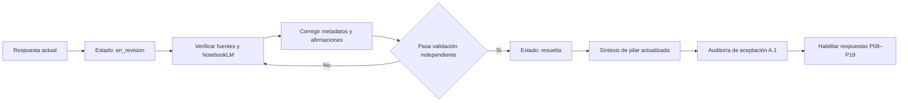

# Especificación — Etapa A.1: remediación y aceptación de la base Jev

Fecha: 2026-09-20  
Estado: propuesta aprobada para revisión documental  
Alcance: pilares P01–P07; 140 respuestas y 7 síntesis existentes.

## Propósito

Convertir la Etapa A en una base de conocimiento verificable antes de usarla para dirigir P08–P18. La remediación conserva las respuestas existentes: corrige evidencia, metadatos, estados y recomendaciones sin borrar el historial de investigación.

## Decisión de operación

La Etapa B no podrá declarar ninguna respuesta `resuelta` mientras A.1 no esté aceptada. Se permite reunir fuentes de P08–P13 en estado `borrador_de_fuentes`, sin crear conclusiones ni recomendaciones operativas.

## Inventario que se corrige

| Activo | Cantidad | Tratamiento |
|---|---:|---|
| Respuestas P01–P07 | 140 | Conservar, auditar y corregir individualmente. |
| Síntesis P01–P07 | 7 | Rehacer después de corregir las respuestas de su pilar. |
| Registro CSV | 140 filas resueltas | Cambiar a `en_revision` hasta que cada respuesta pase la aceptación. |
| Catálogo de fuentes | 55 fuentes | Incorporar, reemplazar o retirar las 21 referencias citadas que no están catalogadas. |

## Contrato de cada respuesta

Cada archivo `JEV-Pxx-nnn.md` debe contener:

1. Metadatos YAML completos: `id`, `pilar`, `pregunta`, `estado`, `notebooks_consultados`, `fuentes`, `nivel_evidencia`, `fecha_revision` y `revisor`.
2. Las diez secciones exigidas por el cuestionario maestro: respuesta directa, alcance, evidencia, explicación, ejemplo y contraejemplo, aplicaciones, controles de falla, validación, recomendación y fuentes.
3. Una tabla de evidencia por afirmación verificable, con fuente primaria, URL accesible, localizador, fecha de consulta y clasificación: `documentado_proveedor`, `evidencia_independiente`, `hipotesis_de_diseno` o `pendiente_de_validacion`.
4. Un registro de consultas al NotebookLM: URL o identificador del cuaderno, consulta literal, fecha y un extracto o referencia verificable de la respuesta.
5. Recomendaciones que distingan explícitamente entre práctica confirmada, propuesta de arquitectura y decisión que requiere benchmark local.

No basta con una redacción extensa. Una respuesta queda `resuelta` solamente cuando cumple el contrato, sus referencias existen en el catálogo y no tiene una contradicción abierta con una fuente primaria.

## Correcciones prioritarias

### 1. Trazabilidad y estados

Cambiar las 140 filas actuales a `en_revision`. Mantener la puntuación original como `puntuacion_autoevaluacion`; añadir `puntuacion_revision_independiente` y `resultado_revision`.

### 2. Fuentes

Resolver las 21 claves `SRC-XXXX` ausentes. Cada clave debe ser agregada al catálogo con título, autor, fecha, URL, tipo de fuente y nivel de independencia; si no puede verificarse, debe ser retirada de la respuesta y sustituida por `pendiente_de_validacion`.

Los documentos internos y cuadernos canónicos pueden servir como trazabilidad de investigación, pero no como evidencia independiente de afirmaciones sobre producto, latencia, precio, API o calibración.

### 3. Correcciones de contenido confirmadas

Corregir `JEV-P05-001`: la documentación oficial de TypeSafe indica que `Noul` no devuelve el campo `confidence`; no debe afirmarse una fórmula de `confidence` para Noul como comportamiento de API documentado.

Revisar y etiquetar las cifras de latencia, precio, límites de estado, límites de tasa, métricas de calibración y comparativas. Ninguna cifra debe presentarse como universal si depende de región, red, versión, carga, caso de uso o medición propia.

### 4. Recomendaciones de alto impacto

Las recomendaciones para QRT, Wheelwork, FIX, ERP, umbrales numéricos, ejecución automática y exclusión de NMT deben quedar como `hipotesis_de_diseno` hasta completar una validación local con datos sintéticos o autorizados. Ninguna síntesis debe interpretar una hipótesis como política aprobada.

### 5. Portabilidad

Sustituir todos los enlaces `file:///Users/...` por rutas Markdown relativas dentro de `docs/programa-jev/`.

## Flujo de trabajo

## Validación y criterios de aceptación

A.1 se acepta cuando se cumplan todos los puntos siguientes:

- 140/140 respuestas tienen YAML completo y diez secciones.
- 0 referencias `SRC-XXXX` faltantes del catálogo.
- 140/140 respuestas registran al menos una consulta de NotebookLM y al menos una fuente accesible.
- 0 afirmaciones de API contradicen la documentación oficial vigente.
- 0 recomendaciones de alto impacto aparecen como decisiones aprobadas sin una evidencia local asociada.
- 7/7 síntesis usan rutas relativas y separan hechos, hipótesis y pendientes.
- Una revisión independiente registra resultado y puntuación en el CSV.

## Fuera de alcance

Esta etapa no ejecuta código, no integra API, no conecta cuentas, no opera sistemas QRT/Wheelwork, no cambia permisos de cuadernos y no publica artefactos.

## Entregables

1. Respuestas P01–P07 corregidas.
2. Catálogo de fuentes sin identificadores huérfanos.
3. Registro CSV actualizado con evidencia de revisión independiente.
4. Siete síntesis corregidas y portables.
5. Informe de aceptación A.1 con resultados por pilar y lista explícita de pendientes, si los hubiera.
